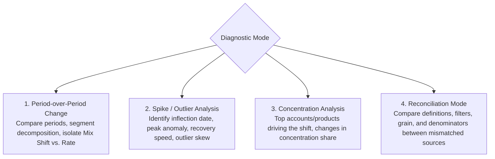

# Metric Diagnostics (`/metric-diagnostics`)

In enterprise management and data analytics, the most critical question executives ask is rarely *"What is today's revenue?"* but rather:
> **"Why did this metric drop sharply compared to last month?"**  
> **"What drove the sudden spike in loan balances over the past week?"**  
> **"Why does this dashboard metric disagree with our audited financial statements?"**

The **`/metric-diagnostics` (Diagnose Metric Change)** skill is purpose-built to answer "Why" questions, isolating root causes, quantifying driver contributions, and presenting mathematically sound explanations.

---

## 1. The 5-Criteria Evaluation Rubric (P-N-R-M-C)

To ensure AI responses match the quality expected of a Senior Analytics Consultant, Semantix enforces the **P-N-R-M-C Rubric**. Any diagnostic explanation failing these criteria is flagged as substandard:

```
┌────────────────────────────────────────────────────────────────────────┐
│                        THE P-N-R-M-C EVALUATION RUBRIC                 │
├────────────────────────────────────────────────────────────────────────┤
│  [P] Pattern Before Cause       ──→ Magnitude + Timeline + Scope first │
│  [N] Standardized Driver Labels ──→ Verified / Likely / Unresolved     │
│  [R] Residuals Explicitly Stated──→ Sum of drivers ≈ 100%, state delta │
│  [M] Measurement Errors Ruled Out─→ Partial periods, freshness, joins  │
│  [C] Coincidence ≠ Causality    ──→ Co-occurring events are hypotheses │
└────────────────────────────────────────────────────────────────────────┘
```

### Rubric Breakdown:

| Code | Criterion | Standard Requirement | Common Antipattern |
|---|---|---|---|
| **P** | **Pattern Before Cause** | Responses **must open with the high-level pattern**: **Magnitude of change** (absolute delta and percentage), **Timeline** (start date, peak inflection, recovery trajectory), and **Scope** (system-wide vs. isolated segment). Only after establishing the pattern may causes be introduced. | Leaping straight to premature conclusions: *"Revenue fell because the Downtown branch underperformed"* without stating system-wide loss magnitude or timing. |
| **N** | **Standardized Driver Labels** | Every identified driver must be tagged with exactly **1 of 3 standardized confidence labels**:<br/>1. **Verified:** Confirmed via direct quantitative data matching shift magnitude.<br/>2. **Likely:** Sound business hypothesis with partial supporting evidence, lacking direct metric proof.<br/>3. **Unresolved:** Unexplained variance or missing source data.<br/>*If the engine supplies a label, the AI is strictly forbidden from upgrading it.* | Speculative assertions: *"Losses are definitely caused by churn"* when evidence only supports a plausible correlation. |
| **R** | **Residuals Explicitly Stated** | Deconstructed drivers must be mutually exclusive and sum to approximately 100% of the net variance. The final row of the driver breakdown **must state the residual variance** with an explicit figure or explicitly note *"No residual variance"*. | Listing 3 drivers whose sum totals 130% of the variance; or listing several points and ignoring an unexplained 30% residual. |
| **M** | **Measurement Errors Ruled Out** | Technical and data pipeline errors must be audited and dismissed before proposing business hypotheses:<br/>- **Partial Periods (CALC-06):** If the current month is only 14 days in, do not compare against a full prior month.<br/>- **Data Freshness:** What is the latest recorded transaction timestamp?<br/>- **Join Fan-Out:** Did table joins duplicate rows and inflate metrics?<br/>- **Shifting Denominators (CALC-08):** Did definition criteria for the active cohort change between periods? | Concluding *"Active user engagement plunged 50%"* when the current month only contains 15 days of data. |
| **C** | **Coincidence ≠ Causality** | An event occurring simultaneously (e.g., a holiday weekend, competitor launch, or pricing change) **remains a hypothesis** until the affected customer segment and monetary magnitude match the observed drop. | Prematurely blaming external events: *"Sales fell due to the holiday weekend"* without verifying if non-holiday categories also dropped. |

---

## 2. Four Core Diagnostic Modes

When `/metric-diagnostics` is invoked, the engine routes analysis through 1 of 4 specialized diagnostic modes:



1. **Period-over-Period Change:**
   - Evaluates changes between Current and Prior (or Year-over-Year) periods.
   - Disentangles **Mix Shift** (portfolio allocation shifts toward lower-value categories) from **Internal Rate Changes** within individual segments.
2. **Spike / Outlier Analysis:**
   - Designed for sudden spikes or abrupt drops over tight timeframes.
   - Maps the time-series trajectory: Inflection Point $\rightarrow$ Apex Spike $\rightarrow$ Recovery Rate.
3. **Concentration Analysis:**
   - Evaluates whether overall metric shifts are driven by extreme outlier entities (e.g., a handful of corporate accounts drawing down credit facilities).
4. **Reconciliation Mode:**
   - Deployed when two separate reports track the same metric but yield divergent figures.
   - Performs head-to-head comparison across 4 dimensions: Metric Definition, Filter Predicates, Data Grain, and Base Denominators.

---

## 3. Standardized Output Structure

An analytical response from `/metric-diagnostics` follows a structured 5-part template:

### Real-World Example: "Why did CASA deposit balances decline in August vs. July?"

#### 1. Pattern Overview
- **Target Metric:** Average Daily CASA Deposit Balance.
- **Comparison Window:** August 2026 vs. July 2026 (comparing 31 full days like-for-like).
- **Shift Magnitude:** Decreased by **-\$18.5M** (**-6.2%** vs. July).
- **Timeline & Scope:** The downturn commenced in Week 3 of August, concentrated heavily in the SME Banking segment.

#### 2. Root-Cause Drivers & Residuals

| Impact Driver | Variance (Delta) | % Contribution | Confidence Label |
|---|---|---|---|
| SME commercial clients drawing down cash for inventory imports | -\$13.2M | 71.4% | **Verified** (Transactional wire transfer logs) |
| Southern Regional Branch deposit contraction | -\$3.7M | 20.0% | **Verified** (Branch network ledger) |
| Capital reallocated to Fixed Deposits (FD) | -\$1.2M | 6.5% | **Likely** (Corresponds with FD promotional rate launch) |
| **Residual Variance** | **-\$0.4M** | **2.1%** | **Unresolved** |
| **Total Variance** | **-\$18.5M** | **100%** | |

#### 3. Business Context (Why It Matters)
The sharp drawdowns by SME commercial clients in the third week coincide with pre-holiday inventory purchase cycles, paired with corporate treasury teams locking idle liquidity into short-term promotional fixed deposit yields.

#### 4. Data Quality & Measurement Audit
- **Period Integrity:** Both July and August contain full 31-day transaction cycles (CALC-06 compliant).
- **Data Freshness:** Ledger snapshot closed at 23:59 on August 31, 2026.
- **No Duplicate Joins:** Reconciled branch sums match aggregate bank-wide control totals with zero discrepancy.

#### 5. Recommended Strategic Actions
Recommend that Corporate Relationship Managers proactively reach out to the top 15 SME accounts with the highest outflows to offer competitive trade finance lines and automated sweep accounts.

---

## 4. Analytical Guardrails & Common Traps

To maintain rigorous standards, Semantix models are bound by specific computational guardrails:

1. **Incomplete Period Trap (CALC-06):**
   If today is the 18th of the month, Semantix automatically compares the first 18 days of the current month against the first 18 days of the prior month, or explicitly annotates *"Data reflects MTD through Day 18"*. It never compares partial periods against full calendar months.
2. **Averaging Averages Trap (CALC-07):**
   When diagnosing Average Order Value (AOV) or Non-Performing Loan (NPL) ratios, Semantix **never averages regional averages**. It computes metrics from raw totals:
   $$\text{System AOV} = \frac{\sum \text{Revenue}}{\sum \text{Orders}} \neq \text{AVG}(\text{Branch AOV})$$
3. **Conflating Mix Shift with Volume:**
   Revenue declines can stem from either: (1) lower sales volume across all items, or (2) customers shifting toward lower-margin products. Semantix mathematically isolates these factors.
4. **Locale Number Formatting (VIEW-02):**
   In English interfaces, numerical figures format with comma thousands separators (`850,000`), `M` for millions (`$3.2M`), and `B` for billions (`$1.5B`), with period decimals (`12.5%`).
