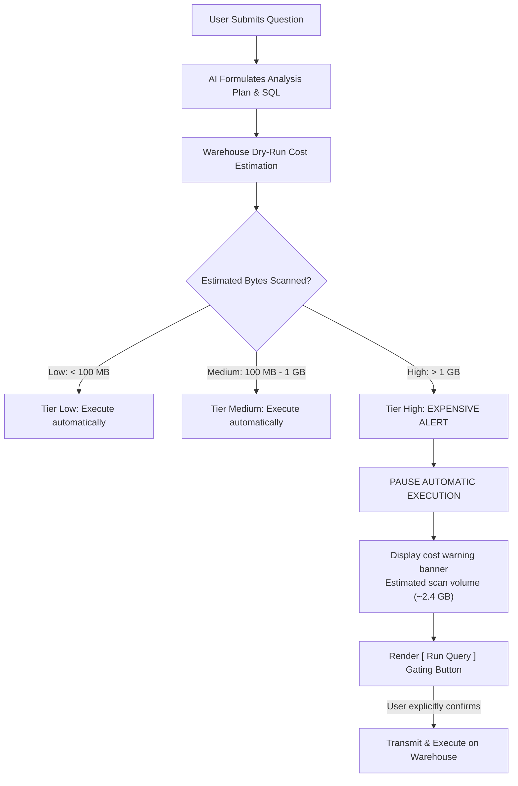

# Query Transparency & Debug Pipeline

A primary barrier preventing enterprises from deploying AI in operational analytics is **hallucination risk and opacity**. When an AI assistant presents a figure or chart, business stakeholders inevitably ask:
- *Where did this data originate? What exact SQL executed behind the scenes?*
- *Is this fresh data from the warehouse or served from a stale cache?*
- *Did this query scan hundreds of gigabytes and incur unexpected cloud bills?*

Semantix eliminates these concerns through **Absolute Transparency**: every response, data table, and visualization in Semantix Chat is accompanied by a **Persistent Execution Status Bar**, **Automated Cost Guardrails**, and an in-depth **Technical Specs Drawer**.

---

## 1. Persistent Execution & Evidence Status Bar

Directly beneath every data visualization and tabular result in chat, Semantix renders a clean, persistent status bar displaying execution telemetry:

```
┌────────────────────────────────────────────────────────────────────────────────────────┐
│ [Revenue Trend Chart]                                                                  │
├────────────────────────────────────────────────────────────────────────────────────────┤
│ 🛡️ 12 rows · 3 cols · from cache · latest period Aug 2026           [ ⚠️ 1 warning ]   │
└────────────────────────────────────────────────────────────────────────────────────────┘
```
*(Or when a query executes live on BigQuery or Snowflake)*
```
┌────────────────────────────────────────────────────────────────────────────────────────┐
│ 🛡️ 150 rows · 4 cols · freshly run · ~45.60 MB scanned              [ Evidence → ]     │
└────────────────────────────────────────────────────────────────────────────────────────┘
```

### Core Telemetry Parameters:

| Metric | Technical Meaning | Transparency & Honesty Mandates |
|---|---|---|
| **Rows & Columns (`rows`, `columns`)** | Dimensions of the result matrix returned by the database. | Informs users immediately of dataset scope without needing to paginate. |
| **Data Origin (`fromCache` vs `freshlyRun`)** | - **from cache:** Served instantaneously from the local Query Cache with zero warehouse compute cost.<br/>- **freshly run:** SQL query was transmitted and executed directly against the live warehouse. | If data is refreshed without new metadata, the badge is withheld rather than displaying misleading status. |
| **Bytes Scanned (`bytesScanned`)** | Total volume of data scanned by the warehouse engine (e.g., `~45.60 MB`, `~1.2 GB`). | Displayed only when the underlying warehouse provides byte metrics (e.g., Google BigQuery). Never defaults to "0 MB" if unsupported. |
| **Latest Period (`latestPeriod`)** | The most recent timestamp recorded in the dataset (e.g., `Aug 2026`, `Q2 2026`, `2026-09-15`). | Computed from time-axis values, immediately alerting users to data lag or pipeline delays. |
| **Warning Chips** | - **Amber:** Alerts to temporal anomalies (e.g., incomplete month).<br/>- **Red:** Alerts to omitted segments or filter exclusions. | Clicking the warning badge opens the detail explanation tab immediately. |

---

## 2. Cost Control & Manual Run Gating for Expensive Queries

In modern pay-per-scan cloud data warehouses (such as Google BigQuery or Snowflake), unoptimized queries scanning multi-terabyte log tables can incur substantial costs within seconds.

Semantix guards against this with **Pre-Execution Dry-Run Cost Checks** and **Manual Run Gating (`planRequiresManualRun`)**:



### Operational Mechanism:
1. **Query Cost Tiers (`QueryCostTier`):**
   - **Low (Green):** Nominal compute cost (fractions of a cent); executes automatically and returns results immediately.
   - **Medium (Amber):** Standard query compute volume; executes automatically.
   - **High (Red):** Resource-intensive queries exceeding organizational cost thresholds (scanning gigabytes or terabytes).
2. **Manual Run Confirmation (`planRequiresManualRun`):**
   For High-Tier queries, Semantix **withholds automatic execution**. The interface presents the Analysis Plan, proposed SQL, estimated data volume, and an explicit **Run Query** button. The query is only sent to the warehouse when an authorized user clicks to approve execution.

---

## 3. Technical Specs Drawer & Pipeline Debugging

To audit every step in the AI reasoning chain, click the **Technical Specs** or **Evidence** button located in the status bar.

This opens the slide-out **Technical Specs Drawer**, structured into 3 transparent panels:

```
┌────────────────────────────────────────────────────────────────────────────────────────┐
│ 💻 TECHNICAL SPECS & DEBUG PIPELINE                                                    │
├────────────────────────────────────────────────────────────────────────────────────────┤
│ [ 📄 Query Intent ]    [ 💻 SQL Statement ]    [ 📋 Execution Plan & Warnings ]         │
├────────────────────────────────────────────────────────────────────────────────────────┤
│ • Query Type: Aggregation                                                              │
│ • Target Metric: Net Revenue (net_revenue)                                             │
│ • Dimensions: [ Region (region), Order Month (order_month) ]                           │
│ • Recommended Chart: Stacked Bar                                                       │
│ • Cost Estimate: $0.002 (~42.10 MB scanned)                                            │
├────────────────────────────────────────────────────────────────────────────────────────┤
│ SELECT                                                                                 │
│     d.region_name AS region,                                                           │
│     DATE_TRUNC('month', f.order_date) AS order_month,                                  │
│     SUM(f.amount - COALESCE(f.discount, 0)) AS net_revenue                              │
│ FROM fact_orders f                                                                     │
│ JOIN dim_regions d ON f.region_id = d.id                                               │
│ WHERE f.order_date >= '2026-01-01'                                                     │
│ GROUP BY 1, 2                                                                          │
│ ORDER BY 2 ASC, 3 DESC                                                                 │
└────────────────────────────────────────────────────────────────────────────────────────┘
```

### 3.1 Tab 1 — Query Intent
Displays how the Semantix Intent Classifier parsed the request:
- Identified metric and mapped Semantic Context definition.
- Assigned dimensions mapped to `GROUP BY` clauses.
- Applied filter predicates (differentiating system defaults from user-specified filters).
- Optimal visualization chart recommendation.

### 3.2 Tab 2 — SQL Statement (Generated SQL)
- Renders the full executable SQL statement with syntax highlighting.
- Includes a **Copy SQL** button to facilitate testing in DBeaver, DataGrip, or Cloud Consoles.

### 3.3 Tab 3 — Execution Plan & Warnings
- Details sequential execution stages processed by the AI pipeline.
- **Temporal Warnings:** Flags partial time periods or timezone boundaries.
- **Semantic Warnings:** Notifies users if specific segments were dropped due to sparse data or forbidden metric-dimension combinations.

---

## 4. Evidence Sheet & Data Reconciliation

In addition to technical specifications, business stakeholders can inspect empirical verification data via the **Evidence Sheet**:
- **Calculation Step-Through:** Documents the mathematical transformation path from raw warehouse values to final scorecard numbers.
- **Reconciliation Check:** Reconciles chart metrics against warehouse Control Totals, guaranteeing no rows were dropped during joins or aggregation steps.
