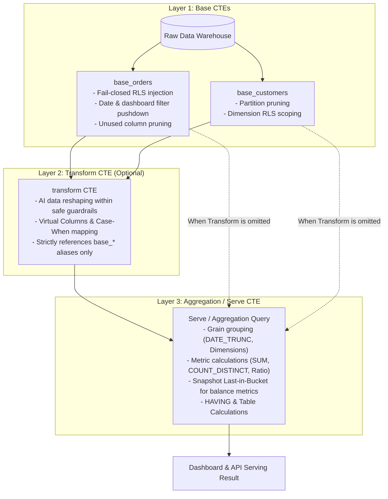

# 3-Layer Compiler Architecture

> **Document Scope:** In-depth technical specification of the Semantix Semantic Core SQL Compilation Engine.  
> **Target Components:** Core Engine, Query Compiler, Semantic Layer, Dashboard Data Serving.

---

## 1. Overview & Design Philosophy

In legacy BI systems and first-generation Text-to-SQL solutions, SQL generation typically relied on **query wrapping** or naive string concatenation. When a user applied dashboard filters or Row-Level Security (RLS), the engine would wrap the entire AI-generated query in an outer subquery and append an external `WHERE` clause:

```sql
-- Legacy Anti-Pattern (Query Wrapping) - Prone to critical semantic errors
SELECT * FROM (
    -- Pre-aggregated or AI-generated query
    SELECT branch_code, AVG(order_value) AS avg_val FROM orders GROUP BY branch_code
) sub
WHERE region IN ('North', 'South');
```

This legacy approach introduces catastrophic flaws when deployed at enterprise scale:
1. **Post-Aggregation Filtering Pitfall:** Applying filters after data has already been aggregated violates the mathematical integrity of non-additive metrics (e.g., averages, percentiles, ratios).
2. **Fan-Out Join Multiplication:** When joining 1-to-N relationships (e.g., `orders` joined to `order_items`), parent order revenue is multiplied across lines before aggregation, yielding inflated totals.
3. **RLS Security Vulnerabilities:** Wrapping external RLS conditions around complex subqueries containing `UNION`, `GROUP BY`, or `WINDOW` functions can cause SQL syntax errors or accidentally leak unauthorized records through execution order bypasses.

To eliminate these structural vulnerabilities, Semantix engineered the **3-Layer Compiler Architecture (Base → Transform → Agg)**.



---

## 2. Layer-by-Layer Architectural Breakdown

### 2.1. Layer 1: Base CTE — Extraction, Slicing & Security Enforcement

The Base Layer serves as the primary security and optimization perimeter. Every referenced physical table (`BaseTable`) is compiled into an isolated Common Table Expression (CTE) prefixed with `base_<alias>`.

#### Core Mechanisms in Layer 1:

1. **Fail-Closed RLS Enforcement at Source:**
   - User Row-Level Security predicates (e.g., `branch_code = 'BRANCH_NORTH'`) are injected **directly into the `WHERE` clause of each individual Base CTE**.
   - Tables containing the security attribute receive the predicate; tables without it are safely bypassed or validated against relation scopes.
   - Eliminates fragile external SQL wrappers (`wrapSqlWithRls`) that could be bypassed via subqueries or unions.

2. **Filter Pushdown:**
   - Global dashboard filters, such as runtime date ranges (`RuntimeDateRange`) and categorical selectors (`RuntimeFilter`), are analyzed and pushed down into the Base CTE of the owning table.
   - Filtering occurs **prior to any record joins or aggregation**, preserving non-additive statistical validity.

3. **Partition Pruning:**
   - For columnar cloud data warehouses (Google BigQuery, Snowflake, ClickHouse), the compiler identifies partition key columns and applies static or dynamic partition boundaries (`pinLatestPartition`), eliminating expensive full table scans.

4. **Unused Column Pruning:**
   - Instead of emitting wasteful `SELECT * FROM table`, the compiler traverses the entire Abstract Syntax Tree (AST) of both Layer 2 (Transform) and Layer 3 (Agg). It isolates the exact minimal set of required columns (dimensions, metric sources, filter attributes, join keys).
   - Only required columns are projected in the Base CTE `SELECT` clause, drastically reducing network I/O and warehouse memory overhead.

```sql
-- Compiled Layer 1 (PostgreSQL dialect example)
WITH base_orders AS (
    SELECT 
        id, 
        customer_id, 
        order_date, 
        amount, 
        branch_code
    FROM sales.orders
    WHERE branch_code = 'BRANCH_NORTH'                  -- Injected RLS predicate
      AND order_date >= DATE '2026-01-01'              -- Pushed-down date boundary
      AND order_date <= DATE '2026-03-31'
      AND status IN ('PAID', 'COMPLETED')              -- Pushed-down dashboard filter
),
base_customers AS (
    SELECT 
        id, 
        segment, 
        region
    FROM core.customers
    WHERE region = 'Northern_Region'                   -- Pushed-down dimension filter
)
```

---

### 2.2. Layer 2: Transform CTE — Guarded Data Transformation

Layer 2 provides a sandbox for complex business transformations: multi-table joins, Virtual Column evaluation (`CASE WHEN`), RFM clustering, cohort categorization, or analytical window functions (`WINDOW FUNCTION`).

#### Compilation Guardrails:
- **Base Alias Confinement:** All identifiers in the `FROM` and `JOIN` clauses of Layer 2 must strictly reference `base_*` CTE aliases declared in Layer 1 or auxiliary CTEs defined inside the transform block.
- **Physical Table Rejection (`TRANSFORM_PHYSICAL_TABLE_REF`):** If an AI model or custom query attempts to query raw tables directly (e.g., `FROM orders` instead of `FROM base_orders`), compilation aborts immediately. This guarantees no query path can circumvent RLS and pushed-down filters.
- **Strict Read-Only Enforcement (`TRANSFORM_NOT_READ_ONLY`):** Enforces AST-level validation across 7 SQL dialects, rejecting mutation commands (`DROP`, `INSERT`, `UPDATE`, `ALTER`, `EXECUTE`, `xp_cmdshell`, etc.).
- **Automatic Outer Limit Stripping (`TRANSFORM_ORDER_LIMIT_STRIPPED`):** Any outer `ORDER BY`, `LIMIT`, or `TOP` clauses within the Transform definition are automatically stripped, delegating final sorting and pagination authority strictly to Layer 3 (Agg).

#### Dry-Run Schema Verification:
Before executing on production data, the compiler can dispatch a validation query (`dryRunSql`) parameterized with `LIMIT 0` (or `TOP 0` on MSSQL). This introspects exact output column metadata (`outputColumns`) and data types directly from the database engine with zero row scans.

```sql
-- Compiled Layer 2 joining two Base CTEs
transform AS (
    SELECT 
        o.id AS order_id,
        o.order_date,
        o.amount,
        c.segment,
        CASE 
            WHEN o.amount >= 10000000 THEN 'VIP'
            WHEN o.amount >= 2000000 THEN 'STANDARD'
            ELSE 'MASS'
        END AS customer_tier
    FROM base_orders o
    LEFT JOIN base_customers c ON o.customer_id = c.id
)
```

---

### 2.3. Layer 3: Serve / Aggregation CTE — Metric Aggregation & Delivery

The Aggregation Layer consumes the output from Layer 2 (or directly from Layer 1 if no transformation step is required) and compiles the final result set for dashboards, scorecards, or downstream API consumers.

#### 1. Temporal Grain Truncation:
Applies dialect-aware temporal grouping functions:
- **PostgreSQL:** `DATE_TRUNC('month', order_date)`
- **BigQuery:** `DATE_TRUNC(order_date, MONTH)`
- **MySQL:** `DATE_FORMAT(order_date, '%Y-%m-01')`
- **Snowflake / DuckDB / ClickHouse:** Corresponding native engine adapters.

#### 2. Semi-Additive Balance Metrics (Snapshot Last-in-Bucket):
For point-in-time balance indicators (e.g., credit loan balance, bank deposit balance, inventory stock):
- **The Business Trap:** Outstanding debt on Jan 31 is \$10M, and on Feb 28 is \$12M. In a quarterly report, summing both values ($10M + $12M = $22M) is mathematically invalid. The quarterly figure must reflect the **latest closing balance within that period bucket**.
- The 3-Layer Compiler automatically injects the snapshot wrapper:
  $$\text{SUM}(\text{CASE WHEN } \text{closing\_date} = \text{MAX}(\text{closing\_date in bucket}) \text{ THEN balance\_val END})$$
- Ensures mathematical accuracy across arbitrary temporal grains without requiring analysts to construct intricate subqueries manually.

#### 3. Table Calculations (23 Post-Processing Functions):
Analytical operations such as Running Total, Percent of Total, Difference from Previous, Moving Average, and Rank are performed deterministically, providing flexible and performant visualization rendering.

```sql
-- Compiled Layer 3 final query
SELECT 
    DATE_TRUNC('month', order_date) AS order_month,
    segment,
    SUM(amount) AS total_revenue,
    COUNT(DISTINCT order_id) AS unique_orders,
    SUM(amount) / NULLIF(COUNT(DISTINCT order_id), 0) AS aov
FROM transform
GROUP BY 1, 2
HAVING SUM(amount) > 0
ORDER BY order_month DESC, total_revenue DESC
LIMIT 100;
```

---

## 3. Engineering Justification: Solving the Three Enterprise Failures

| Technical Challenge | Traditional BI / Text-to-SQL Approach | System Failure | Semantix 3-Layer Solution |
|---|---|---|---|
| **Non-Additive Metrics** (Averages, Medians, Ratios) | Outer query wrapper: `SELECT * FROM (subquery) WHERE filter` | Post-aggregation filtering causes Simpson's Paradox and skewed averages. | Pushes all filters directly into Base CTEs; aggregation executes solely over pre-filtered raw partitions. |
| **Fan-Out Join Multiplication** (1-to-N Join Cardinality) | Arbitrary table joins in single-tier queries | Parent table metrics (e.g., `orders.revenue`) duplicate when joined with line items (`order_items`). | Analyzes cardinality via `hasFanOutRisk`; isolates aggregation grains or enforces safe relational contracts. |
| **Row-Level Security (RLS)** | Suffixing `WHERE branch = 'x'` at the end of the query string | Easily bypassed via subqueries, `UNION`, or breaks on complex CTE structures. | Enforces **Fail-Closed** RLS injection directly into each Base CTE `WHERE` clause. |

---

## 4. Execution & Rollout Strategy: Shadow Mode & Serve Mode

To guarantee safe zero-downtime migration and ensure zero mathematical regression on production dashboards, Semantix utilizes an automated dual-mode deployment framework governed by environment flags.

### 4.1. Shadow Mode (`THREE_LAYER_SHADOW=1`)

- **Dual Execution Pattern:** The dashboard queries and presents data from the legacy query engine (Strategy A).
- **Asynchronous Shadow Execution (Fire-and-Forget):** Concurrently, the compiler translates the semantic spec into 3-Layer SQL and dispatches it against the target database in the background.
- **Cell-by-Cell Reconciliation:**
  - Compares numerical results cell-by-cell within floating-point tolerance ($\epsilon = 10^{-6}$).
  - Emits structured JSON audit logs prefixed with `[three_layer_shadow]` containing statuses: `match`, `mismatch`, `grain_differs`, or `exec_error`.
  - Upon mismatch, captures up to 5 representative delta rows alongside both generated SQL statements for root-cause analysis.
- **Zero User Impact:** Shadow queries run under dedicated query timeouts and isolated worker pools, avoiding latency penalties for dashboard viewers.

### 4.2. Direct Serve Mode (`THREE_LAYER_SERVE=1`)

Once dashboards achieve a verified 100% reconciliation match in Shadow Mode, administrators enable production serving:

1. **Granular Dashboard Targeting (`THREE_LAYER_SERVE_DASHBOARDS`):**
   - Supports phased rollout by dashboard ID (comma-delimited list) or platform-wide activation (`*`).
2. **Single Optimized Query Dispatch:**
   - Only the compiled 3-Layer SQL query executes against the warehouse, minimizing resource utilization and maximizing throughput.
   - Response metadata confirms provenance via `servedBy: "three_layer"`.
3. **Verification Mode on Staging (`THREE_LAYER_SERVE_VERIFY=1`):**
   - Active on Staging/UAT: Serves results via 3-Layer Compiler while executing legacy queries concurrently in the background to continuously verify parity.
4. **Fail-Closed Fallback Engine:**
   - If anomalous behavior is detected during execution (e.g., widget column mismatch against spec, RLS mapping ambiguity, or dry-run validation error), the engine **immediately falls back to the legacy pipeline** and logs `status: "fallback"`. End users never encounter broken widgets or system errors.

---

## 5. Specification Contract (`ThreeLayerSpec`)

The compilation contract between semantic planning agents and the execution engine is strictly typed via Zod schema (`lib/semantic/three-layer/spec.ts`):

```json
{
  "version": 1,
  "base": {
    "tables": [
      { "alias": "o", "table": "orders" },
      { "alias": "c", "table": "customers", "joinRole": "nullSupplying", "filterMode": "scope" }
    ],
    "joins": [
      { "left": "o", "right": "c", "type": "left", "on": "o.customer_id = c.id" }
    ]
  },
  "transform": {
    "alias": "transform",
    "sql": "SELECT o.id, o.amount, o.order_date, c.region FROM base_o o LEFT JOIN base_c c ON o.customer_id = c.id"
  },
  "agg": {
    "columns": [
      { "kind": "dimension", "sourceColumn": "region", "outputKey": "region" },
      { "kind": "metric", "sourceMetric": "total_revenue", "outputKey": "revenue" }
    ],
    "grain": "month",
    "timeColumn": "order_date"
  }
}
```

---

## 6. Summary

The Semantix 3-Layer Compiler Architecture establishes an enterprise-grade Semantic Layer that reconciles **the flexible generation capabilities of AI models** with **the deterministic mathematical rigor and security boundaries of a modern query compiler**.

By isolating RLS in Base CTEs, sandboxing transformations in Layer 2, and centralizing metric aggregations in Layer 3, every dashboard and analytical query achieves mathematically proven accuracy, fail-closed security, and optimal execution performance.
