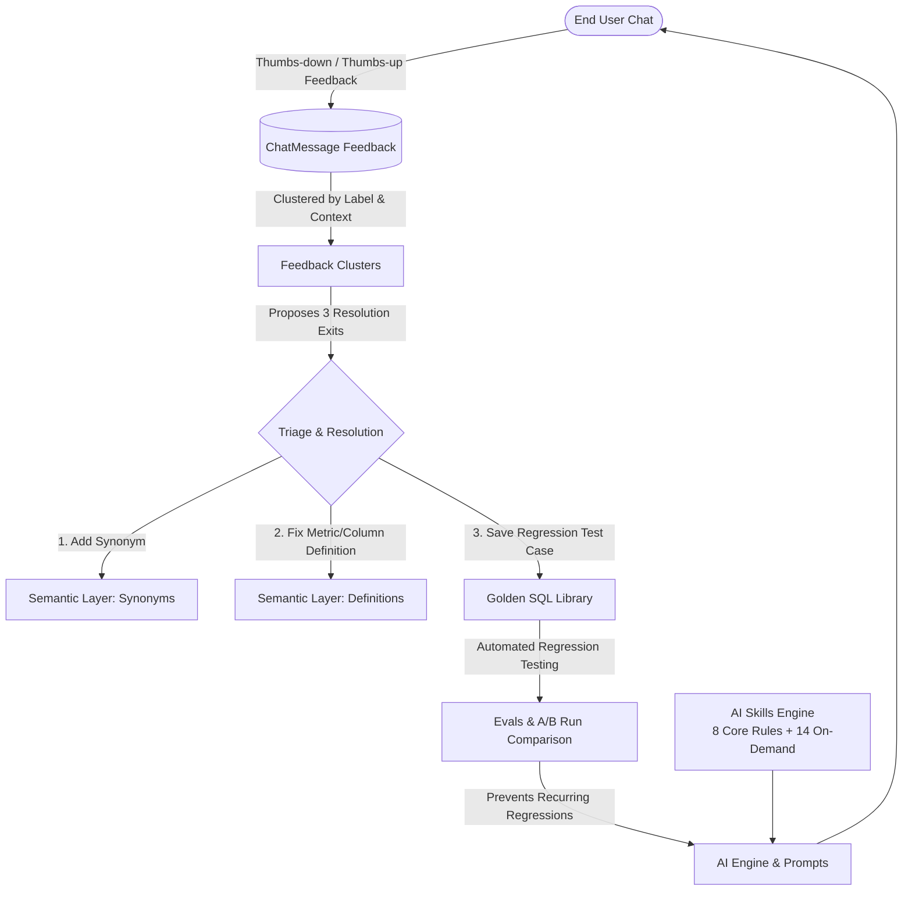

# Semantix AI Hub Overview

The **AI Hub** in Semantix Studio serves as the enterprise command center for Administrators, Data Engineers, and Analytics Engineers to govern, measure, and continuously elevate the quality of AI analytical assistants across the organization.

Rather than treating AI as an unpredictable "black box," the AI Hub provides visual, transparent, and quantitatively verifiable tooling. This ensures every answer, SQL query, and analytical insight delivered by Semantix remains accurate, dependable, and strictly aligned with enterprise business semantics.

---

## 1. Operating Philosophy of AI Hub

The AI Hub architecture operates on three foundational principles:

1. **Trust but Verify (Transparent and Automated Verification):**
   Every AI-generated response is coupled with its underlying SQL query, ground-truth metrics retrieved from the data warehouse, scanned bytes, and cloud compute costs. No assertions or conclusions are presented without quantitative backing evidence.

2. **Closed Feedback Loop:**
   Negative end-user feedback (thumbs-down ratings) is never lost or scattered across disparate logs. The AI Hub automatically clusters complaints, identifies root causes, and generates targeted remediation actions to continuously refine the Semantic Layer.

3. **Deterministic Mechanical Evaluation:**
   Model quality and query correctness are validated automatically against curated **Golden SQL** test suites. Instead of relying on subjective "LLM-as-a-judge" scoring, Semantix executes queries against the live database to detect regressions deterministically.

---

## 2. The Four Core Pillars of AI Hub

The AI Hub is built around four primary pillars:

### 1. AI Skills Registry
- Centrally manages domain-specific analytical methodologies and business guidelines.
- Structured into **8 Inherent Core Rules** (always loaded invisibly to enforce business logic, temporal boundaries, data integrity, and security guardrails) and **14 On-Demand Skills** (triggered via the `/` slash menu or recognized automatically from user intent).
- Features live prompt previews, token consumption guardrails, 30-day usage analytics, and user satisfaction tracking per skill.

> Learn more in: [AI Skills Registry](skills.md)

### 2. Feedback Clusters & Remediation Loop
- Aggregates thousands of user feedback items into coherent **Feedback Clusters** grouped by semantic data context (`contextId`) and issue taxonomy (`derivedLabel`).
- Synthesizes user complaints into concise **Rationales** and recommends actionable remediation steps (**Suggested Actions**).
- Prioritizes issues strictly by **affected conversation count (`affectedCount`)**, enabling data teams to tackle the highest-impact semantic bottlenecks first.
- Provides three decisive resolution pathways: **Add Synonym**, **Fix Field/Metric Definition**, or **Create Eval Case / Save Golden SQL**.

> Learn more in: [Feedback Loop & Suggestion Clusters](feedback-loop.md)

### 3. Model Evaluations & Testing (Evals)
- Automated batch evaluation engine that runs test suites against real-world data in connected data warehouses.
- Tracks execution runs (`EvalRun` and `EvalRunCase`) and computes overall test accuracy across model versions and semantic configuration changes.
- Features visual A/B run comparisons governed by a **"Regressions First"** philosophy (broken test cases are highlighted before fixed cases).
- Classifies failures into 7 deterministic mechanical root causes (`EvalRootCause`)—such as mismatched row counts (`row_count`), ordering discrepancies (`row_order`), value divergence (`values_differ`), and syntax errors (`invalid_sql`)—without relying on subjective LLM scoring.

> Learn more in: [Model Evaluations & Testing (Evals)](evals.md)

### 4. Golden SQL Library
- Curated repository of validated "Natural Language Question – Ground-Truth SQL Query" pairs certified by data practitioners.
- Features dual-tier storage capturing both raw SQL queries and structured `QueryIntent` JSON specifications.
- Employs cosine vector similarity search (`pgvector`) alongside pinned example rules (`isPinned`) to construct optimal few-shot prompts for SQL generation.

> Learn more in: [Golden SQL Management](golden-sql.md)

---

## 3. 30-Day Performance Overview Dashboard

Navigating to `/admin/ai-hub` displays the **Overview** dashboard, presenting system health metrics across the rolling 30-day window:

| Metric | Definition & Computation | Recommended Action |
|---|---|---|
| **Satisfaction Rate** | Percentage of positive ratings: `thumbs-up / (thumbs-up + thumbs-down)`. Displays `—` if no ratings exist. | If the rate falls below 85%, audit open feedback clusters under the Suggestions tab. |
| **Unresolved Negative** | Total volume of negative ratings awaiting remediation (no synonym added, no definition fixed, no eval case created). **Not capped to 30 days.** | Drive this metric toward zero. A flawed query from two months ago remains technical debt until remediated. |
| **Unlabelled** | Substantive comments (≥ 8 characters) that have not yet been assigned a thematic issue label. | Trigger cluster re-indexing (`Rebuild`) to classify and cluster pending items. |
| **Eval Accuracy** | Percentage of passing test cases in the most recent evaluation run for the selected context. | Must achieve 100% pass rates before deploying major semantic model or prompt updates to production. |
| **Cost & Calls** | Total estimated cloud expenditure (USD) and volume of AI assistant invocations over the last 30 days. | Monitor to detect anomalous cost spikes or token threshold violations. |
| **Hot Labels** | Top 5 most frequent complaint labels with trend indicators comparing current vs. previous periods. | Click any label chip to filter corresponding dialogue threads in the Quality tab. |

---

## 4. Role-Based Access Control (RBAC) Permissions

Operating within the AI Hub requires specific administrative entitlements:

- `view_feedback`: Read access to feedback logs, AI Hub Overview metrics, and conversation quality audits.
- `edit_suggestion`: Manage feedback clusters (triage, transition states to `in_progress`, `resolved`, or `dismissed`), and execute cluster rebuilding jobs (`rebuild`).
- `manage_models` / `manage_context`: Configure and toggle AI Skills, customize prompt overrides, curate Golden SQL entries, and execute evaluation suites (`Evals`).

---

## 5. Next Steps

Explore the individual AI Hub modules in depth:
- [AI Skills Registry](skills.md)
- [Feedback Loop & Suggestion Clusters](feedback-loop.md)
- [Model Evaluations & Testing (Evals)](evals.md)
- [Golden SQL Management](golden-sql.md)
- [Configuring AI Providers & Google Vertex AI](../ai-providers.md)
