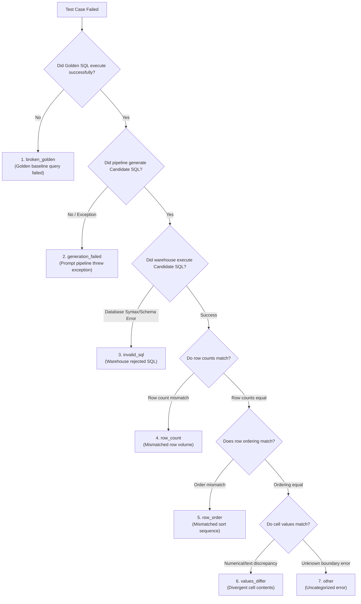

# Model Evaluations & Testing (Evals)

The **Evaluations (Evals)** system in Semantix Studio serves as the enterprise safeguard ensuring AI query accuracy never regresses when updating system prompts, upgrading large language models (LLMs), or modifying Semantic Context definitions.

In enterprise data analytics, a subtle syntax alteration or misplaced join condition can distort executive metrics by millions of dollars. Semantix Evals automates end-to-end regression testing, executing queries against production-grade data warehouses to detect discrepancies deterministically.

---

## 1. Test Architecture: `EvalRun` & `EvalRunCase`

The evaluation framework is anchored on two core data structures:

1. **`EvalRun` (Evaluation Suite Execution):**
   - Represents a comprehensive test execution covering all test cases within a specific Semantic Context (`contextId`).
   - Captures lifecycle metadata: start/completion timestamps, triggering user, target LLM provider/model, execution run label, aggregate accuracy rate (`accuracy`), total passed cases (`passedCount`), and total failed cases (`failedCount`).

2. **`EvalRunCase` (Individual Test Case Evaluation):**
   - Evaluates a single natural language question against its verified counterpart in the **Golden SQL** library.
   - The test runner passes the natural language prompt through the Semantix generation pipeline to yield a Candidate SQL query.
   - Executes both the **Golden SQL** and the **Candidate SQL** on the live data warehouse, subsequently comparing their tabular outputs using the deterministic `compareResultSets` engine.
   - Logs execution outcome (`passed` or `failed`), query latency, generated SQL code, and mechanical failure taxonomy (`rootCause`).

---

## 2. Visual A/B Run Comparison: The "Regressions First" Philosophy

When engineering teams alter a system prompt or adjust semantic metric definitions, how can they prove the new version is superior to the baseline?

Semantix provides an interactive **A/B Run Comparison** view at `/admin/ai-hub/evals/[contextId]`. By selecting a Base Run and a Head Run, the engine partitions differences into three explicit groups:

```
┌────────────────────────────────────────────────────────────────────────────────────────┐
│ RUN COMPARISON: [Base: Run #12 (92%)] ──→ [Head: Run #13 (94%)]                         │
├────────────────────────────────────────────────────────────────────────────────────────┤
│ ❌ BROKEN / REGRESSIONS · 1 case                                                       │
│   • "Monthly retail revenue by territory for prior month"                              │
│     Reason: Row count differs: expected 5, got 0 (Candidate SQL failed to execute)     │
├────────────────────────────────────────────────────────────────────────────────────────┤
│ ✅ FIXED · 2 cases                                                                     │
│   • "Top 10 customer accounts by total deposit balances"                               │
│   • "Q2 non-performing loan ratios partitioned by branch"                              │
├────────────────────────────────────────────────────────────────────────────────────────┤
│ ⚠️ STILL FAILING · 1 case                                                              │
│   • "Active credit card holders with zero transactions"                                │
└────────────────────────────────────────────────────────────────────────────────────────┘
```

### The "Regressions First" Principle:
> *"Three fixes and one break is not a win until someone has looked at the one."*

Standard benchmarking dashboards often celebrate net percentage gains and bury newly introduced errors under green celebration banners. Semantix rejects this approach:
- The **Broken / Regressions** bucket is **permanently pinned to the VERY TOP** of the review screen, highlighted in high-visibility alert red.
- Administrators are required to inspect broken queries to verify that critical business questions have not suffered regressions before approving deployments to production.

---

## 3. The 7 Deterministic Mechanical Root-Cause Classifications

A prevalent antipattern in modern evaluation platforms is using an auxiliary LLM (LLM-as-a-judge) to grade SQL failures. Semantix **eliminates LLM judges** for SQL evaluation:
- Whether a query encounters a dialect syntax error, returns truncated rows, or exhibits numerical drift is an **objective mechanical reality**.
- Re-prompting an LLM to "inspect" database errors introduces unnecessary latency, burns cloud budget, and risks hallucinated diagnoses.

Instead, Semantix classifies failures into **7 Deterministic Root Causes (`EvalRootCause`)** derived mechanically by the execution test runner:



### Detailed Root Cause Reference:

| Root Cause Code | Display Name | Technical Nature & Remediation Strategy |
|---|---|---|
| `broken_golden` | **Broken Golden** | The reference Golden SQL query itself failed to execute on the warehouse (e.g., source table renamed, column dropped, or test authored with flawed syntax).<br/>👉 **Resolution:** Update or repair the Golden SQL baseline; model logic is not at fault. |
| `generation_failed` | **Generation Failed** | The AI pipeline threw an uncaught exception, exceeded token boundaries, or returned an empty payload; no SQL was transmitted to the database.<br/>👉 **Resolution:** Inspect system logs, verify API provider credentials, or increase context token allocation. |
| `invalid_sql` | **Invalid SQL** | The AI generated SQL, but the data warehouse rejected it (e.g., dialect mismatch, calling non-existent UDFs, or invalid data type casts).<br/>👉 **Resolution:** Add dialect-specific syntax examples or reinforce schema typing rules in Context. |
| `row_count` | **Row Count Mismatch** | Candidate SQL executed cleanly but returned a different number of rows than the Golden standard (e.g., Golden returned 10 rows, AI returned 100 or 0).<br/>👉 **Resolution:** Investigate missing `LIMIT` clauses, omitted `WHERE` predicates, or join fan-out multiplication. |
| `row_order` | **Row Order Mismatch** | Row count and contents match, but sequence differs on an order-sensitive query (e.g., "Top 5 Products by Sales" missing `ORDER BY sales DESC`).<br/>👉 **Resolution:** Reinforce sorting requirements in prompt rules for Top-N and ranking queries. |
| `values_differ` | **Values Differ** | Table dimensions and row counts match perfectly, but inner cell values diverge (e.g., Golden returns \$1,500,000, AI calculates \$1,200,000).<br/>👉 **Resolution:** Audit metric calculation expressions or check for omitted discount/refund exclusion rules. |
| `other` | **Other** | Edge-case discrepancies not captured by primary runner assertion boundaries. |

---

## 4. Root Cause Breakdown Badges

Directly beneath the A/B comparison metrics, the dashboard renders an aggregated **Root Cause Breakdown**:

```
HEAD RUN ROOT CAUSES
[ Invalid SQL · 3 ]  [ Row Count Mismatch · 2 ]  [ Values Differ · 1 ]
```

These diagnostic badges eliminate guesswork:
- High prevalence of `invalid_sql` points to dialect syntax errors.
- Dominance of `broken_golden` indicates upstream schema drifts in the physical warehouse.
- Clustering around `row_count` indicates filtering or join predicate bugs.

---

## 5. Recommended Pre-Deployment Evaluation Workflow

To ensure zero-downtime semantic stability before deploying changes:

1. **Step 1 — Curate Test Suite:** Maintain 20–50 certified Golden SQL cases representing core enterprise reporting queries.
2. **Step 2 — Execute Base Run:** Trigger an `EvalRun` against the existing production setup to record baseline accuracy (e.g., 92%).
3. **Step 3 — Apply Modifications:** Refine System Prompts, attach or modify AI Skills, or adjust Semantic Context definitions.
4. **Step 4 — Execute Head Run:** Trigger a fresh `EvalRun` across the updated configuration.
5. **Step 5 — Compare Runs:** Open the **A/B Comparison** view. Review the **Broken / Regressions** bucket: if any test cases appear in this section, **block deployment immediately** until root causes are remediated.
