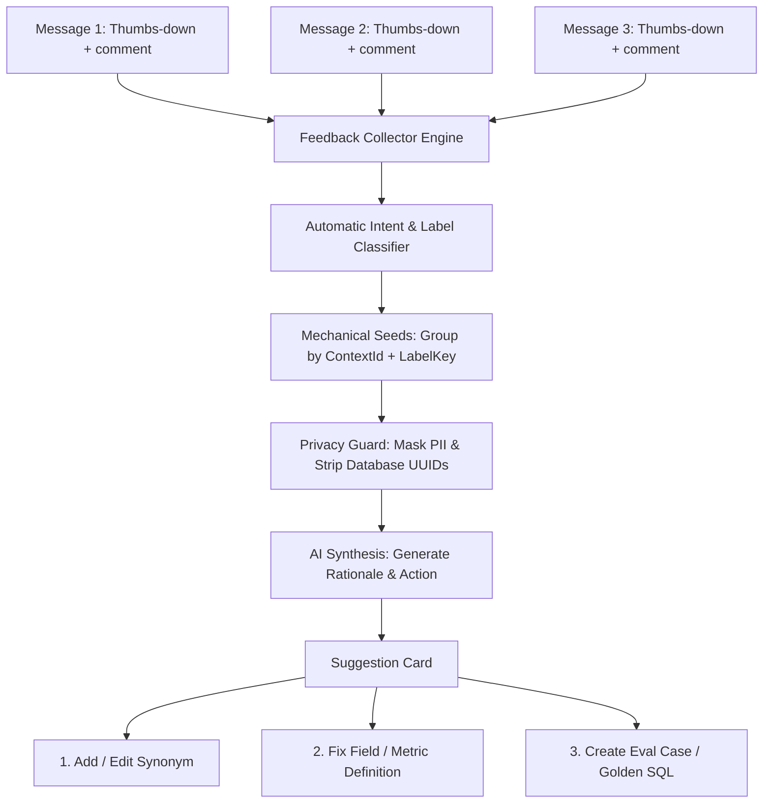

# Feedback Loop & Suggestion Clusters

One of the greatest obstacles in maintaining an enterprise AI analytics assistant is **closing the negative feedback loop**. When business users submit thumbs-down ratings accompanied by critical feedback ("net revenue figure is wrong", "does not recognize VIP customer classification", "fails to deduct refunds"), traditional monitoring systems dump hundreds of isolated complaint tickets into an unwieldy backlog:
- Data teams drown in unstructured noise.
- Identifying which failure modes inflict the greatest organizational friction is nearly impossible.
- Engineers must reconstruct full conversation threads manually to understand why users were dissatisfied.

Semantix resolves this challenge through a **Closed Feedback Loop** powered by automated **Feedback Clustering (`FeedbackCluster`)**.

---

## 1. Mechanical Grouping & AI Insight Architecture

Instead of reviewing isolated comments line by line, Semantix synthesizes thousands of user reactions into a concise, prioritized backlog of actionable fixes.



### 1.1 Two-Tier Clustering Strategy
1. **Tier 1 — Deterministic Mechanical Grouping:**
   The engine aggregates raw feedback records by pairing the semantic context (`contextId`) with the extracted problem label (`labelKey`). This indexing step is **100% mechanical, executing deterministically with zero LLM API costs**.
2. **Tier 2 — Semantic Insight Generation:**
   For each distinct cluster, the AI processes up to 10 representative feedback comments (`SAMPLE_COMMENTS`) to generate:
   - **Rationale:** A concise 2–3 sentence synthesis describing the core failure mode in the user's native vocabulary.
   - **Suggested Action:** A direct imperative prescription detailing what must be altered within the Semantic Layer.
   - **Target Field:** Identifies the precise Column or Metric most probable of being the root cause.

### 1.2 Enterprise Privacy & Guardrails
When invoking LLMs to synthesize rationales, Semantix enforces strict data governance:
- **No Internal UUID Leakage:** When querying schema metadata (`loadCandidateFields`), the engine supplies only human-readable labels (`displayName || name`). Database UUIDs, table IDs, and internal system identifiers are strictly withheld from prompt context.
- **Untrusted Input Sanitization (`wrapUntrustedData`):** All user comments are wrapped in protective delimiter boundaries to neutralize adversarial prompt injections embedded in user feedback.

### 1.3 Cost Budgeting During Rebuild (`rebuildFeedbackClusters`)
- To prevent uncontrolled LLM token consumption, triggering a manual or scheduled **Rebuild** restricts AI rationale generation to a maximum of **10 pending clusters (`DEFAULT_INSIGHT_BUDGET = 10`)**, prioritizing clusters with the highest affected volume.
- Previously analyzed clusters retain their existing rationales while updating their conversation count metrics without consuming additional API calls.

---

## 2. Suggestion Cards & Volume-Driven Prioritization

In the `/admin/ai-hub/suggestions` console, each feedback cluster is represented as a high-density **Suggestion Card**:

```
┌────────────────────────────────────────────────────────────────────────────────────────┐
│ [ Label: Undefined Net Revenue ]  [ Status: Open ]            Context: Retail Banking  │
│                                                           💬 Impact: 18 conversations │
├────────────────────────────────────────────────────────────────────────────────────────┤
│ Rationale: Users repeatedly query net revenue and merchant discounts, but the AI       │
│ defaults to gross transaction value because refund deductions are missing in metadata. │
│                                                                                        │
│ → Update the Net Revenue metric formula to subtract discounts and refunds from gross.  │
│                                                                                        │
│ 🎯 Suspect Field: Net Revenue (net_revenue)                                            │
├────────────────────────────────────────────────────────────────────────────────────────┤
│ [ View 18 Conversations ]          [ 3 Actionable Exits ]            [ Triage Status ▼ ]│
└────────────────────────────────────────────────────────────────────────────────────────┘
```

### Objective Impact Prioritization:
Priorities are never arbitrary. Clusters are ranked by **Affected Conversation Count (`affectedCount`)**. A semantic ambiguity confusing 25 analysts during month-end closing automatically outranks an isolated issue encountered once.

---

## 3. The Three Actionable Exits

Rather than stopping at passive error logging, every Suggestion Card and Quality audit log provides **three decisive technical exits** to permanently resolve the issue:

### Exit 1: Add Synonym (Create / Edit Synonyms)
- **When to use:** Users query data using business jargon, slang, or internal abbreviations absent from technical schema column names (e.g., asking for "whale accounts" instead of "VIP Clients", or "top-line" instead of "Gross Billings").
- **Action:** Clicking **Edit Synonym** opens the `FeedbackFixDialog`, allowing engineers to map colloquial terms directly to the target Column or Metric. Subsequent queries match with 100% precision.

### Exit 2: Fix Definition (Update Column / Metric Metadata)
- **When to use:** Queries miscalculate because field descriptions in metadata are ambiguous, units are misaligned (e.g., column stores thousands of USD but AI interprets raw USD), or metric calculation logic lacks necessary exclusion filters.
- **Action:** Clicking **Fix Definition** (`fixDefinition`) routes administrators directly into the metadata model editor to refine calculation formulas, documentation notes, and boundary constraints.

### Exit 3: Create Eval Case / Save Golden SQL
- **When to use:** The user's query represents a recurring canonical question or exposed a critical calculation regression.
- **Action:**
  - If the conversation contains an engineer-verified, corrected SQL query, click **Save to Golden SQL**.
  - If the model failed to produce valid SQL, click **Create Eval Case**. The system captures the natural language prompt into the permanent regression test suite. Any future model or prompt change that degrades this query will fail automated test runs.

---

## 4. Triage Workflow & Toast Undo Mechanism

Feedback clusters transition through 4 operational triage stages:

1. **`open`:** Freshly identified failure pattern awaiting engineering review.
2. **`in_progress`:** Assigned to an Analytics Engineer currently editing the Semantic Layer or SQL test suite.
3. **`resolved`:** Remediation complete (synonym added, definition adjusted, or Golden SQL saved).
4. **`dismissed`:** Invalid complaint (e.g., out-of-scope query requesting data not housed within the enterprise warehouse).

### Instant Toast Undo:
Changing cluster status (e.g., marking an item as *Dismissed* or *Resolved*) removes it immediately from the active view to keep the workbench clutter-free. A floating Toast notification provides a 5-second **Undo** action, allowing operators to reverse mistaken clicks instantaneously.

---

## 5. Unresolved Negative Metric Tracking

On the AI Hub Overview dashboard, the **Unresolved Negative (`unresolvedNegative`)** counter represents the true technical debt of your data platform:

- A negative rating is recognized as **Acted On** if and only if it exits through one of the three definitive pathways:
  $$\text{Acted On} \iff (\text{Saved to Golden SQL}) \lor (\text{Created Eval Case}) \lor (\text{Applied Semantic Fix})$$
- Merely reading a comment or manually changing status without applying a technical fix **will not decrement this counter**.
- **No 30-Day Expiration:** Unlike rolling activity metrics, Unresolved Negative is lifetime-scoped. A flawed query from three months ago remains an open failure until remediated.
