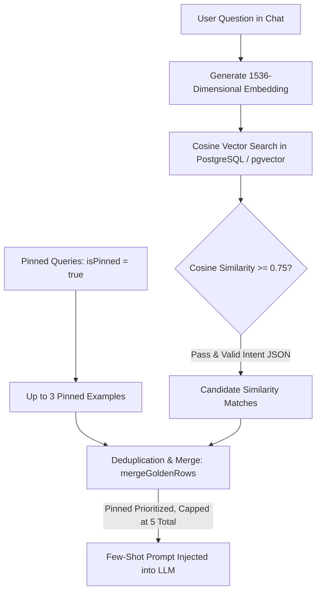

# Golden SQL Management

**Golden SQL** is the enterprise repository of verified **"Natural Language Question – Reference SQL Query"** pairs curated, tested, and certified by Data Engineers and Analytics Engineers in Semantix.

Within the Semantix architecture, Golden SQL serves two mission-critical roles:
1. **Ground Truth for Evals:** Serves as the immutable standard for automated regression testing and model accuracy benchmarking.
2. **In-Context Few-Shot Learning:** When users ask questions in chat, Semantix dynamically retrieves the most relevant Golden SQL examples to inject into the LLM prompt as few-shot demonstrations, ensuring the model adopts standardized query syntax and business logic.

---

## 1. Dual-Tier Storage: Raw SQL & Structured QueryIntent JSON

A foundational design advancement in Semantix is dual-tier persistence:
- **Executable SQL Query (`sql`):** The exact SQL statement executed against the live data warehouse for evaluation benchmarks and technical auditability.
- **Query Intent Specification (`intent`):** Persisted as a `JSONB` document representing the formal `QueryIntent` object (specifying query `type`, primary `metric`, `dimensions`, `filters`, and recommended `chartType`).

```json
{
  "type": "aggregation",
  "metric": "net_revenue",
  "dimensions": ["order_date", "store_region"],
  "filters": [
    { "field": "status", "operator": "eq", "value": "completed" }
  ],
  "chartType": "line"
}
```

### Why Persist Structured `QueryIntent` JSON?
The Semantix Intent Extractor converts natural language user prompts into a deterministic, strictly validated JSON representation before SQL generation. If only raw SQL strings were supplied as few-shot examples, the intent extraction model would lack structural guidance for downstream schema decomposition. By storing both the validated JSON intent and the raw SQL, Semantix provides few-shot demonstrations for both intent parsing and query synthesis.

---

## 2. Vector Similarity Search & Pinned Example Governance

When a user submits a question in chat, how does Semantix select the most effective Golden SQL examples for the prompt context?

The retrieval pipeline combines **Semantic Vector Search (`pgvector`)** with **Pinned Canonical Precedence (`isPinned`)**:



### Quantitative Selection Guardrails:
1. **Minimum Similarity Threshold (`GOLDEN_FEWSHOT_MIN_SIMILARITY = 0.75`):**
   Only queries exhibiting cosine similarity $\ge 0.75$ against the user's prompt are considered. Low-scoring queries are discarded to prevent prompt dilution.
2. **Pinned Canonical Examples (`isPinned` — Up to 3, `GOLDEN_PINNED_MAX = 3`):**
   Queries embodying organizational accounting rules or complex domain conventions (e.g., specific CASA calculation methods or holiday calendar overrides) can be pinned by administrators. Pinned items **bypass the vector similarity threshold** and are prioritized to establish mandatory canonical conventions.
3. **Total Few-Shot Budget Ceiling (`GOLDEN_FEWSHOT_TOTAL_MAX = 5`):**
   The merger consolidates pinned items (up to 3) with top vector matches, deduplicates overlapping records, and strictly enforces a ceiling of 5 few-shot examples per inference call.

---

## 3. Golden SQL Certification & Verification Workflow

No query enters the Golden SQL library without empirical validation. The lifecycle spans 4 rigorous steps:

```
[ Ingest Candidate ] ──→ [ Execute Test Run ] ──→ [ Certify isApproved ] ──→ [ Pin isPinned ]
 (From Chat or Studio)    (runFeedbackSqlTest)      (Eligible for Evals)       (Injected in Few-Shot)
```

### Step 1: Candidate Ingestion
- **From User Chat:** When an assistant response receives a thumbs-up rating (or when an engineer manually corrects SQL from a thumbs-down turn), administrators click **Save to Golden SQL**.
- **Manual Authoring in Studio:** In `/studio/golden-sql` (or within Context detail tabs), engineers input natural language questions and write reference SQL statements directly.

### Step 2: Live Test Execution (`runFeedbackSqlTest`)
Prior to saving, administrators must trigger a live test execution:
- Sends the candidate SQL directly to the connected data warehouse.
- Measures and surfaces performance metrics:
  - **Latency:** Execution time in milliseconds (`durationMs`).
  - **Row Volume:** Verification that results are non-empty (`rowCount`).
  - **Data Scanned & Cloud Cost:** Megabytes/Gigabytes scanned and estimated query cost (`bytesProcessed`, `costEstimate`).
  - **Result Preview:** Renders the first 10 rows of data to verify output accuracy visually.

### Step 3: Approval Certification (`isApproved`)
- Once query execution is verified, toggle `isApproved = true`.
- The engine calculates a 1536-dimensional embedding of the natural language prompt and stores it in the `embedding` column using `pgvector`.
- The certified query becomes an active **Eval Case** in automated regression test suites.

### Step 4: Canonical Pinning (`isPinned`)
- For foundational business patterns, toggle `isPinned = true`.
- Pinned queries are consistently prioritized in few-shot prompt construction across that Semantic Context.

---

## 4. Library Administration in Studio

Within the Golden SQL management console, teams can:
- **Filter by Status:** View approved, pending review, and pinned queries.
- **Search by Content:** Perform full-text search across questions, table names, and SQL statements.
- **Track Feedback Metrics:** Inspect thumbs-up and thumbs-down counts associated with answers that leveraged specific Golden SQL examples.
- **Edit & Version:** Update SQL queries when business definitions evolve, with full version tracking preserved in system audit logs.
