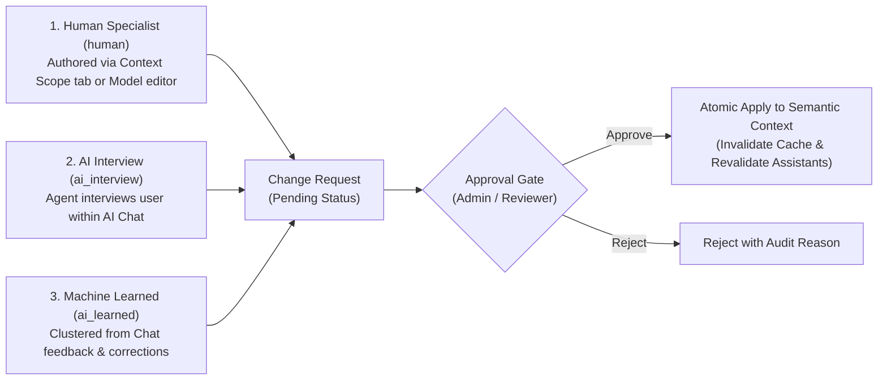

# Semantic Change Requests

> **Navigation:** Studio → DABI → Change Requests (or navigate directly to `/admin/change-requests`)

In an enterprise analytics architecture, the Semantic Layer is the single source of truth dictating how AI models interpret queries and calculate financial and operational metrics. Unauthorized or erroneous alterations to synonyms, formulas, or security perimeters can silently corrupt hundreds of executive reports and downstream decision pipelines.

The **Change Requests** workflow establishes a rigorous governance framework: enabling any business stakeholder to propose localized domain knowledge while restricting modification rights to authorized semantic administrators.

---

## 1. Core Governance Principle: "Anyone May Propose, Only Reviewers Approve"

In enterprise practice:
- **Domain Vocabulary Experts:** Frontline sales managers, accountants, and branch operators who interact with the AI assistant daily have the most accurate grasp of colloquial business terms and operational acronyms.
- **System Administrators (Data Leads / Semantic Engineers):** Hold write access to Data Models and Contexts but cannot anticipate every niche departmental term or colloquial synonym across the organization.

Semantix bridges this gap by decoupling rights into two distinct tiers:
1. **Proposal Rights (`propose`):** Requires only **`VIEW`** permission on a Semantic Context. Any user discovering an AI misinterpretation can initiate a proposal via conversational AI interviews or the Context editor UI.
2. **Approval Rights (`approve`):** Restricted to users holding explicit semantic administrative privileges (**`canApproveContextChange`** or **`edit_context`**). All submitted proposals are staged in a `pending` state (`status: "pending"`) and never apply automatically.

---

## 2. Three Proposal Origins

The governance engine categorizes every proposal by its provenance via the `origin` attribute:



| Origin Identifier (`origin`) | Description | Ingestion Mechanism |
|---|---|---|
| **Human Specialist (`human`)** | Direct submission by analytics personnel | Created from the Context editor or Scope tab by team members lacking direct publish rights. |
| **Conversational AI Interview (`ai_interview`)** | Interactive interview conducted by the AI Assistant | When a user remarks *"the assistant misunderstood credit balance"*, the `context-interview` skill invokes `clarify_context_needs` to elicit terminology nuances, then dispatches `submit_context_proposal`. |
| **Automated Learning (`ai_learned`)** | Clustered corrections from production usage | When multiple users repeatedly issue chat corrections (e.g., *"by revenue I meant booked billings, not cash collected"*), the Feedback Clustering engine distills an automated semantic update proposal. |

---

## 3. The Two-Halves Safe Payload Pattern

A central architectural challenge in reviewing complex JSON schema modifications is: **How can a reviewer inspect an intuitive visual Diff, while the system executes atomic, non-destructive updates without accidentally overwriting existing metadata?**

Semantix resolves this through the **Two-Halves Safe Payload Pattern**:

```
┌────────────────────────────────────────────────────────────────────────┐
│                        CHANGE REQUEST PAYLOAD                          │
├──────────────────────────────────┬─────────────────────────────────────┤
│    HALF 1: VISUAL SNAPSHOT       │       HALF 2: EXECUTION MAP         │
│     (Renders Visual Diff UI)     │    (Atomic Database Application)    │
├──────────────────────────────────┼─────────────────────────────────────┤
│ • columnContexts: [ ... ]        │ • columnSynonyms: { col_1: [...] }  │
│ • metricContexts: [ ... ]        │ • columnAntiSynonyms: { ... }       │
│ • aiInstructions: "..."          │ • columnGotchas: { ... }            │
│ • defaultSettings: { ... }       │ • metricSynonyms: { met_1: [...] }  │
│                                  │ • metricAntiSynonyms: { ... }       │
└──────────────────────────────────┴─────────────────────────────────────┘
```

### 3.1. Half 1: Visual Snapshot (`columnContexts`, `metricContexts`)
- Stores complete entity arrays pre-merged between existing configuration state and proposed amendments.
- The visual diffing engine (`computeDiff`) consumes Half 1 to render the side-by-side review interface:
  - Newly proposed fields highlighted in green.
  - Supplemental synonyms and anti-synonyms tagged for addition.
  - Modified AI behavioral prompts highlighted in yellow.
- Reviewers audit proposals in seconds without parsing low-level database records.

### 3.2. Half 2: Execution Map (`columnSynonyms`, `columnGotchas`, `metricAiHints`...)
- Comprises explicit, discrete dictionary objects formatted as `Record<EntityID, UpdatedValues>`.
- When the reviewer clicks **Approve**, the server action `applyContextUpdates` consumes Half 2 exclusively.
- **Additive Knowledge Preservation:** Existing synonyms and metadata curated by prior administrators are never overwritten or deleted by an incoming proposal that merely introduces one additional synonym.

> [!IMPORTANT]
> **Payload Integrity Enforcement:** If a payload contains only Half 1, approval succeeds without executing database updates. If it contains only Half 2, the UI cannot compute the visual diff. Semantix strictly validates that both halves are present prior to accepting any proposal.

---

## 4. Segregation of Unmodeled Metric Proposals (`metricCandidates`)

During conversational interviews, business stakeholders frequently request metrics that **do not yet exist in the underlying Data Model** (e.g., *"I want to track Non-Performing Loan Ratio over Total Assets"*).

- **Architectural Safeguard:** A Semantic Context governs semantic relationships over existing columns and metrics; it cannot alter Data Model schema or forge new physical aggregations.
- When `proposeContextChange` encounters unmodeled KPI requests, it extracts them into a separate `metricCandidates` payload.
- These candidates are automatically routed to the **Metric Suggestions Queue** (`/admin/ai-hub/suggestions`), where Data Engineers can review, model, and publish them formally.
- This ensures no stakeholder idea is discarded, while preventing schema corruption in the Semantic Context.

---

## 5. Step-by-Step Reviewer Approval Workflow

1. Navigate to **Studio → DABI → Change Requests**.
2. Filter the incoming queue:
   - **Status:** `Pending`, `Approved`, `Rejected`.
   - **Origin:** Filter by `Human`, `AI Interview`, or `AI Learned`.
3. Open a Change Request to enter the Inspection Workspace:
   - **Provenance Summary Card:** Proposer identity, submission timestamp, and target Context.
   - **Visual Diff Workspace:** Inspect color-coded additions and updates across Columns, Metrics, Anti-Synonyms, Gotchas, and AI Directives.
   - **Impacted Resources Panel:** Audit which AI Assistants and Dashboards depend on the target Context and will be updated upon approval.
4. Execute Decision:
   - **Approve:** Click **Approve**. The engine executes the atomic update via Half 2, invalidates the server-side model cache (`model-cache`), and revalidates all linked AI Assistants instantly.
   - **Reject:** Click **Reject** and provide a mandatory rejection reason. The rejection is permanently recorded in the enterprise Audit Trail for compliance.

---

## 6. Summary

The Semantic Change Request architecture harmonizes **the living, evolving domain expertise of frontline business users** with **the strict governance standards of enterprise data teams**. 

Through origin tagging, two-halves payload safety, candidate metric segregation, and atomic cache invalidation, Semantix ensures your enterprise Semantic Layer grows continuously smarter without compromising governance, stability, or accuracy.
