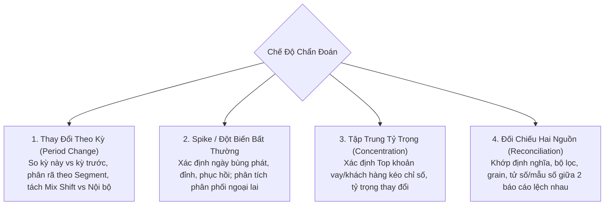

# Chẩn Đoán Biến Động Chỉ Số (`/metric-diagnostics`)

Trong quản trị và phân tích dữ liệu, câu hỏi phổ biến và quan trọng nhất của các nhà lãnh đạo không phải là *"Hôm nay doanh thu bao nhiêu?"* mà là:
> **"Tại sao chỉ số này lại giảm mạnh so với tháng trước?"**  
> **"Cái gì kéo dư nợ tăng đột biến trong tuần qua?"**  
> **"Vì sao số liệu trên Dashboard này không khớp với Báo cáo tài chính?"**

Kỹ năng **`/metric-diagnostics` (Chẩn đoán Biến động Chỉ số)** được thiết kế chuyên biệt để trả lời các câu hỏi "Tại sao", "Vì sao", phân rã nguyên nhân gốc rễ và đánh giá mức độ đóng góp của từng yếu tố một cách khoa học.

---

## 1. Tiêu Chuẩn Đánh Giá Rubric 5 Ô (Bộ Tiêu Chuẩn P-N-R-M-C)

Để bảo đảm câu trả lời của AI luôn đạt chuẩn mực của một Chuyên gia Phân tích Dữ liệu Cao cấp (Senior Analytics Consultant), Semantix áp dụng **Bộ Tiêu Chuẩn Rubric 5 Ô Chấm (P-N-R-M-C)**. Bất kỳ câu trả lời chẩn đoán nào không đáp ứng 5 tiêu chí này đều bị coi là không đạt chuẩn:

```
┌────────────────────────────────────────────────────────────────────────┐
│                        TIÊU CHUẨN RUBRIC P-N-R-M-C                    │
├────────────────────────────────────────────────────────────────────────┤
│  [P] Pattern Trước Nguyên Nhân  ──→ Cỡ + Thời điểm + Phạm vi trước     │
│  [N] Driver Có Nhãn Chuẩn Hoá   ──→ Đã kiểm chứng / Có khả năng / ...  │
│  [R] Nêu Rõ Phần Dư             ──→ Tổng các driver ≈ 100%, có dư      │
│  [M] Loại Trừ Lỗi Đo Lường      ──→ Kỳ chưa trọn, Freshness, Fan-out   │
│  [C] Chống Nhân Quả Trùng Hợp   ──→ Sự kiện cùng lúc chỉ là giả thuyết │
└────────────────────────────────────────────────────────────────────────┘
```

### Chi Tiết Từng Tiêu Chí:

| Ký Hiệu | Tiêu Chí | Yêu Cầu Đạt Chuẩn | Lỗi Trượt Điển Hình |
|---|---|---|---|
| **P** | **Pattern Trước Nguyên Nhân** | Câu trả lời **bắt buộc mở đầu** bằng bức tranh tổng thể: **Độ lớn biến động** (delta tuyệt đối và %), **Thời điểm** (bắt đầu từ ngày nào, đạt đỉnh khi nào, đã hồi phục chưa), và **Phạm vi** (xảy ra trên toàn hệ thống hay chỉ ở một phân khúc cụ thể). Sau đó mới được bàn đến nguyên nhân. | Nhảy bổ ngay vào kết luận: *"Doanh thu giảm do Chi nhánh Quận 1 bán kém"* trong khi chưa cho người đọc biết toàn hệ thống giảm bao nhiêu tiền, từ thời điểm nào. |
| **N** | **Driver Có Nhãn Chuẩn Hóa** | Mọi nguyên nhân tác động (Drivers) bắt buộc phải được gắn đúng **1 trong 3 nhãn tin cậy**:<br/>1. **Đã kiểm chứng:** Có số liệu đo lường trực tiếp, khớp độ lớn biến động.<br/>2. **Có khả năng:** Giả thuyết hợp lý nhưng chưa có dữ liệu đo lường trực tiếp.<br/>3. **Chưa giải quyết:** Phần chênh lệch chưa giải thích được hoặc thiếu dữ liệu.<br/>*Nếu Engine (Why-Analysis) đã cấp nhãn, AI tuyệt đối không được tự ý nâng cấp nhãn.* | Khẳng định hồ đồ: *"Chắc chắn do khách hàng rời bỏ dịch vụ"* trong khi số liệu mới chỉ dừng ở mức phỏng đoán có khả năng. |
| **R** | **Nêu Rõ Phần Dư (Residuals)** | Các nguyên nhân phân rã phải loại trừ lẫn nhau (mutually exclusive) và tổng mức đóng góp phải xấp xỉ bằng tổng biến động ($100\%$). Dòng cuối cùng của bảng nguyên nhân **bắt buộc phải nêu rõ Phần dư** bằng số tiền cụ thể hoặc ghi rõ *"Không có phần dư"*. | Liệt kê 3 nguyên nhân nhưng cộng lại lên tới $130\%$ tổng biến động; hoặc liệt kê một vài lý do rồi lờ đi phần $30\%$ biến động còn lại không biết đi đâu. |
| **M** | **Loại Trừ Lỗi Đo Lường** | Phải rà soát và loại trừ các sai số kỹ thuật trước khi đưa ra kết luận nghiệp vụ:<br/>- **Kỳ chưa trọn (CALC-06):** Tháng này mới đi qua 14 ngày thì không thể so với trọn vẹn tháng trước.<br/>- **Số liệu chậm cập nhật (Freshness):** Ngày cuối cùng ghi nhận giao dịch là ngày nào?<br/>- **Trùng lặp dữ liệu sau import:** Có bị nhân bản dòng (Fan-out) khi JOIN không?<br/>- **Mẫu số trôi (CALC-08):** Định nghĩa "khách hoạt động" có bị thay đổi giữa 2 kỳ không? | Kết luận *"Tỷ lệ khách hàng mua sắm giảm mạnh $50\%$"* trong khi tháng hiện tại mới chỉ có dữ liệu của 15 ngày đầu tháng! |
| **C** | **Không Nhân Quả Từ Trùng Thời Điểm** | Một sự kiện diễn ra cùng thời điểm (như đợt nghỉ lễ Tết, chiến dịch đối thủ, đổi chính sách giá) **chỉ được coi là giả thuyết** cho đến khi chứng minh được phân khúc bị ảnh hưởng và độ lớn tác động khớp chính xác với biến động. | Đổ lỗi ngay lập tức: *"Doanh số giảm vì tháng này có kỳ nghỉ lễ"* mà không kiểm tra xem nhóm sản phẩm thiết yếu có giảm hay không. |

---

## 2. Bốn Chế Độ Chẩn Đoán Cốt Lõi

Khi bạn gọi `/metric-diagnostics`, AI sẽ tự động xác định 1 trong 4 chế độ chẩn đoán phù hợp nhất:



1. **Thay Đổi Theo Kỳ (Period-over-Period Change):**
   - So sánh giữa Kỳ hiện tại (Current) và Kỳ trước (Previous/Cùng kỳ).
   - Tách biệt rõ ràng giữa **Mix Shift** (do dịch chuyển cơ cấu danh mục) và **Hiệu suất nội bộ** của từng phân khúc.
2. **Spike / Sự Cố Bất Thường:**
   - Dành cho các hiện tượng tăng vọt hoặc sụt giảm đột biến trong thời gian ngắn.
   - Tập trung vào chuỗi thời gian: Điểm khởi phát $\rightarrow$ Đỉnh đột biến $\rightarrow$ Tốc độ hồi phục.
3. **Tập Trung Tỷ Trọng (Concentration Analysis):**
   - Đánh giá xem biến động lớn có phải do một vài đối tượng cá biệt chi phối hay không (ví dụ: một vài khách hàng VIP giải ngân số tiền cực lớn kéo toàn bộ tăng trưởng tín dụng).
4. **Đối Chiếu Hai Nguồn (Reconciliation):**
   - Áp dụng khi hai báo cáo cùng đo một chỉ số nhưng cho ra kết quả khác nhau.
   - So sánh đối đầu từng tiêu chí: Định nghĩa, Điều kiện lọc (Filters), Mức độ chi tiết (Grain), và Mẫu số.

---

## 3. Cấu Trúc Đầu Ra Chuẩn Mẫu Của Kỹ Năng

Một câu trả lời hoàn hảo từ Kỹ năng `/metric-diagnostics` sẽ luôn tuân thủ cấu trúc 5 phần gọn gàng, chuẩn xác:

### Ví dụ Thực Tế: "Vì sao số dư tiền gửi không kỳ hạn (CASA) tháng 8 giảm so với tháng 7?"

#### 1. Bức Tranh Biến Động (Pattern)
- **Chỉ số:** Số dư tiền gửi không kỳ hạn bình quân (CASA).
- **Cửa sổ so sánh:** Tháng 8/2026 so với Tháng 7/2026 (so cùng 31 ngày trọn vẹn).
- **Độ lớn:** Giảm **-450 tỷ VNĐ** (tương đương **-6,2%** so với tháng 7).
- **Thời điểm & Phạm vi:** Bắt đầu giảm mạnh từ tuần thứ 3 của tháng 8, tập trung chủ yếu ở phân khúc Khách hàng Doanh nghiệp Vừa và Nhỏ (SME).

#### 2. Phân Rã Nguyên Nhân (Drivers & Residuals)

| Yếu Tố Tác Động (Driver) | Mức Biến Động (Delta) | % Đóng Góp | Nhãn Tin Cậy |
|---|---|---|---|
| Phân khúc Doanh nghiệp SME rút vốn kinh doanh | -320 tỷ VNĐ | 71,1% | **Đã kiểm chứng** (Số liệu sao kê rút tiền) |
| Chi nhánh Miền Nam sụt giảm huy động | -90 tỷ VNĐ | 20,0% | **Đã kiểm chứng** (Báo cáo mạng lưới) |
| Chuyển dịch dòng tiền sang tiền gửi có kỳ hạn (FD) | -30 tỷ VNĐ | 6,7% | **Có khả năng** (Lãi suất FD tăng nhẹ) |
| **Phần dư (Residuals)** | **-10 tỷ VNĐ** | **2,2%** | **Chưa giải quyết** |
| **Tổng biến động** | **-450 tỷ VNĐ** | **100%** | |

#### 3. Ý Nghĩa Nghiệp Vụ (Why It Matters)
Việc các doanh nghiệp SME rút vốn đột ngột trong tuần thứ 3 phản ánh chu kỳ thanh toán đơn hàng nhập khẩu cho mùa vụ cuối năm, kết hợp với việc dòng tiền có xu hướng chuyển sang kỳ hạn ngắn để hưởng lãi suất ưu đãi.

#### 4. Độ Tin Cậy & Lỗi Đo Lường (Measurement Check)
- **Đã kiểm tra:** Cả 2 tháng đều đủ 31 ngày dữ liệu (loại trừ lỗi CALC-06).
- **Freshness:** Dữ liệu chốt tại 23:59 ngày 31/08/2026.
- **Không có trùng lặp:** Đã kiểm tra đối chiếu control total khớp $100\%$ giữa tổng chi nhánh và tổng toàn ngân hàng.

#### 5. Hành Động Tiếp Theo (Next Steps)
Khuyến nghị khối KHDN tiếp cận ngay Top 15 doanh nghiệp SME có số dư rút lớn nhất để chào các gói tài trợ thương mại và ưu đãi giữ chân dòng tiền nhàn rỗi.

---

## 4. Các Bẫy Nghiệp Vụ AI Bắt Buộc Phải Né

Khi phân tích biến động, AI của Semantix được lập trình để tự động phòng tránh các cạm bẫy chết người sau:

1. **Bẫy Tháng Chưa Trọn (CALC-06):**
   Nếu hôm nay là ngày 18 của tháng, AI sẽ tự động so sánh 18 ngày đầu tháng này với 18 ngày đầu tháng trước, hoặc bắt buộc phải ghi rõ *"Dữ liệu tính đến ngày 18"*, tuyệt đối không so với cả 30 ngày của tháng trước.
2. **Bẫy Trung Bình Của Trung Bình (CALC-07):**
   Khi chẩn đoán Giá trị đơn hàng trung bình (AOV) hay Tỷ lệ nợ xấu (NPL), AI **không bao giờ lấy trung bình cộng của các chi nhánh**. Hệ thống luôn tính toán lại từ tổng tử số chia cho tổng mẫu số:
   $$\text{AOV Hệ Thống} = \frac{\sum \text{Doanh Thu}}{\sum \text{Số Đơn Hàng}} \neq \text{AVG}(\text{AOV Chi Nhánh})$$
3. **Bẫy Gộp Nhầm Mix Shift:**
   Doanh thu giảm có thể do: (1) Khách mua ít đi ở từng mặt hàng, hoặc (2) Khách chuyển sang mua mặt hàng giá rẻ hơn. Đây là hai nguyên nhân hoàn toàn khác nhau và bắt buộc phải tách biệt.
4. **Bẫy Đơn Vị Tiền Tệ (VIEW-02):**
   Trong tiếng Việt, AI luôn hiển thị số tiền dạng `3,2 triệu` hoặc `1,5 tỷ` (dấu phẩy thập phân, dấu chấm phân cách nghìn). Tuyệt đối cấm dùng ký hiệu ngoại lai như `3.2M` hay `1.5B` trong văn bản tiếng Việt.
