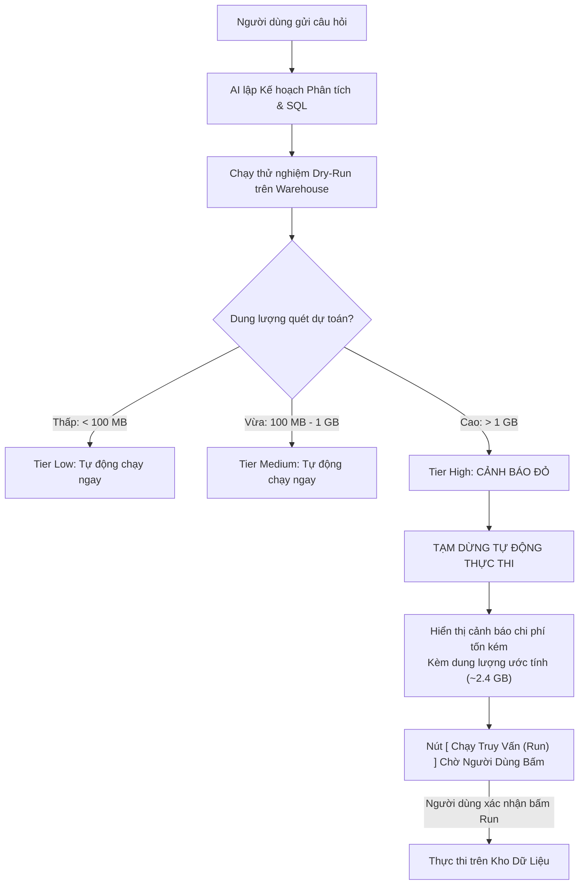

# Minh Bạch Truy Vấn & Debug Pipeline

Một trong những rào cản lớn nhất ngăn các doanh nghiệp ứng dụng AI vào phân tích dữ liệu là **nỗi sợ "ảo giác" (Hallucination)** và **sự thiếu minh bạch**. Khi một trợ lý AI hiển thị một con số hay một biểu đồ, người dùng luôn băn khoăn:
- *Dữ liệu này lấy từ đâu? Câu lệnh SQL chạy ngầm là gì?*
- *Số liệu này mới chạy từ kho dữ liệu hay lấy từ bộ nhớ đệm (Cache)?*
- *Truy vấn này có quét mất hàng trăm Gigabyte dữ liệu và tốn tiền Cloud không?*

Semantix giải tỏa toàn bộ những nghi ngại đó bằng triết lý **"Minh Bạch Tuyệt Đối (Absolute Transparency)"**: Mọi kết quả, bảng số liệu và biểu đồ trong Semantix Chat đều đi kèm **Dòng trạng thái thực thi thường trực**, **Cơ chế kiểm soát chi phí tự động** và **Ngăn kéo Debug Pipeline chuyên sâu**.

---

## 1. Dòng Trạng Thái Thực Thi Thường Trực (Evidence & Result Status Bar)

Ngay bên dưới mỗi biểu đồ và bảng kết quả trong ô chat, Semantix luôn hiển thị một thanh trạng thái màu xám tinh gọn nhưng đầy đủ thông số kỹ thuật:

```
┌────────────────────────────────────────────────────────────────────────────────────────┐
│ [Biểu Đồ Xu Hướng Doanh Thu]                                                           │
├────────────────────────────────────────────────────────────────────────────────────────┤
│ 🛡️ 12 dòng · 3 cột · từ cache · kỳ mới nhất T8/2026                 [ ⚠️ 1 cảnh báo ]   │
└────────────────────────────────────────────────────────────────────────────────────────┘
```
*(Hoặc khi truy vấn mới chạy trên kho dữ liệu BigQuery/Snowflake)*
```
┌────────────────────────────────────────────────────────────────────────────────────────┐
│ 🛡️ 150 dòng · 4 cột · mới chạy · ~45.60 MB đã quét                 [ Bằng chứng → ]   │
└────────────────────────────────────────────────────────────────────────────────────────┘
```

### Các Thông Số Cốt Lõi Trên Thanh Trạng Thái:

| Thông Số | Ý Nghĩa Kỹ Thuật | Nguyên Tắc Trung Thực (Honesty Rules) |
|---|---|---|
| **Số dòng & Số cột (`rows`, `columns`)** | Kích thước chính xác của ma trận kết quả trả về từ cơ sở dữ liệu. | Giúp người dùng biết ngay quy mô tập dữ liệu mà không cần cuộn hết bảng. |
| **Nguồn gốc dữ liệu (`fromCache` vs `freshlyRun`)** | - **Từ cache:** Kết quả được lấy tức thì từ bộ nhớ đệm (Query Cache), không tốn chi phí và tài nguyên kho dữ liệu.<br/>- **Mới chạy:** Câu lệnh SQL vừa được gửi và thực thi trực tiếp trên Data Warehouse. | Nếu dữ liệu được tải lại mà không có metadata mới, hệ thống sẽ ẩn nhãn này thay vì hiển thị thông tin sai lệch. |
| **Dung lượng đã quét (`bytesScanned`)** | Tổng lượng dữ liệu thực tế mà kho dữ liệu đã quét để trả về kết quả (ví dụ: `~45.60 MB`, `~1.2 GB`). | Chỉ hiển thị khi câu truy vấn thực sự chạy trên Warehouse và công cụ CSDL có báo cáo dung lượng (ví dụ: BigQuery). Tuyệt đối không hiển thị "0 MB" nếu CSDL không hỗ trợ đo lường. |
| **Kỳ dữ liệu mới nhất (`latestPeriod`)** | Mốc thời gian mới nhất ghi nhận trong tập dữ liệu (ví dụ: `T8/2026`, `Q2/2026`, `15/09/2026`). | Được tính toán từ các giá trị thực tế của cột trục thời gian, giúp người dùng biết ngay dữ liệu có bị trễ hay không. |
| **Huy hiệu cảnh báo (Warning Chips)** | - **Màu vàng (Amber):** Cảnh báo lệch trục thời gian (ví dụ: tháng chưa trọn).<br/>- **Màu đỏ (Red):** Cảnh báo phân khúc bị bỏ sót (Segment dropped). | Nhấp chuột vào huy hiệu để mở ngay tab giải trình chi tiết. |

---

## 2. Kiểm Soát Chi Phí & Nút Run Thủ Công Cho Truy Vấn Tốn Kém

Trong các kho dữ liệu hiện đại tính tiền theo dung lượng quét (như Google BigQuery hay Snowflake), một câu lệnh thiếu tối ưu hoặc quét toàn bộ bảng log hàng Terabyte có thể tiêu tốn hàng chục đô la chỉ trong vài giây.

Semantix ngăn chặn hoàn toàn rủi ro này bằng cơ chế **Dự toán chi phí trước khi chạy (Dry-Run Cost Estimation)** và **Quy tắc Chặn Thực Thi Thủ Công (`planRequiresManualRun`)**:



### Cơ chế hoạt động:
1. **Phân tầng chi phí (`QueryCostTier`):**
   - **Xanh (Low):** Chi phí rất nhỏ (dưới vài xu), hệ thống tự động thực thi và trả kết quả ngay tức thì.
   - **Vàng (Medium):** Chi phí ở mức bình thường của các truy vấn hàng ngày, hệ thống vẫn tự động chạy.
   - **Đỏ (High):** Chi phí vượt ngưỡng an toàn của doanh nghiệp (quét hàng Gigabyte hoặc Terabyte).
2. **Nút Run Thủ Công:**
   Đối với tầng High (Đỏ), Semantix **sẽ không tự ý chạy câu lệnh**. Giao diện sẽ hiển thị Kế hoạch phân tích, câu lệnh SQL kèm nhãn cảnh báo chi phí và một nút bấm **Chạy truy vấn (Run)**. Chỉ khi người dùng bấm xác nhận, câu lệnh mới thực sự được gửi tới kho dữ liệu. Điều này bảo vệ doanh nghiệp khỏi các khoản hóa đơn Cloud ngoài ý muốn.

---

## 3. Ngăn Kéo Debug Pipeline & Hộp Thoại Thông Số Kỹ Thuật

Để kiểm tra cặn kẽ mọi quyết định của AI, bạn chỉ cần bấm vào nút **Thông số kỹ thuật (Technical Specs)** hoặc nút **Bằng chứng (Evidence)** dưới mỗi kết quả.

Hệ thống sẽ mở ra **Ngăn kéo Debug Pipeline (Technical Specs Drawer)** với 3 tầng thông tin minh bạch:

```
┌────────────────────────────────────────────────────────────────────────────────────────┐
│ 💻 THÔNG SỐ KỸ THUẬT & DEBUG PIPELINE                                                  │
├────────────────────────────────────────────────────────────────────────────────────────┤
│ [ 📄 Ý Định (Intent) ]    [ 💻 Câu Lệnh SQL ]    [ 📋 Kế Hoạch Thực Thi (Plan) ]        │
├────────────────────────────────────────────────────────────────────────────────────────┤
│ • Loại truy vấn (Query Type): Aggregation                                              │
│ • Chỉ số nghiệp vụ (Metric): Doanh thu thuần (net_revenue)                              │
│ • Chiều phân tích (Dimensions): [ Khu vực (region), Tháng đặt hàng (order_month) ]     │
│ • Loại biểu đồ tối ưu (Chart Type): Stacked Bar                                        │
│ • Chi phí ước tính: $0.002 (~42.10 MB)                                                 │
├────────────────────────────────────────────────────────────────────────────────────────┤
│ SELECT                                                                                 │
│     d.region_name AS region,                                                           │
│     DATE_TRUNC('month', f.order_date) AS order_month,                                  │
│     SUM(f.amount - COALESCE(f.discount, 0)) AS net_revenue                              │
│ FROM fact_orders f                                                                     │
│ JOIN dim_regions d ON f.region_id = d.id                                               │
│ WHERE f.order_date >= '2026-01-01'                                                     │
│ GROUP BY 1, 2                                                                          │
│ ORDER BY 2 ASC, 3 DESC                                                                 │
└────────────────────────────────────────────────────────────────────────────────────────┘
```

### 3.1 Tab 1 — Ý Định (Query Intent)
Hiển thị cách AI hiểu câu hỏi của bạn:
- Chỉ số nào được chọn và lấy từ định nghĩa nào trong Context.
- Các chiều phân tích nào được đưa vào `GROUP BY`.
- Các điều kiện lọc nào được áp dụng (bộ lọc mặc định của hệ thống vs bộ lọc do bạn yêu cầu).
- Dạng biểu đồ trực quan hóa được đề xuất.

### 3.2 Tab 2 — Câu Lệnh SQL (Generated SQL)
- Trình bày toàn bộ mã SQL được sinh ra với cú pháp tô màu chuẩn (Syntax Highlighting).
- Hỗ trợ nút **Sao chép (Copy SQL)** để bạn có thể dán trực tiếp vào DBeaver, DataGrip hoặc Google Cloud Console để kiểm tra độc lập.

### 3.3 Tab 3 — Kế Hoạch & Cảnh Báo (Execution Plan & Warnings)
- Liệt kê các bước thực thi mà AI đã trải qua.
- **Cảnh báo thời gian (Temporal Warnings):** Cho biết nếu câu hỏi có chứa các khoảng thời gian chưa hoàn tất (như tháng hiện tại mới qua nửa chặng đường).
- **Cảnh báo ngữ nghĩa (Semantic Warnings):** Thông báo nếu có phân khúc nào bị loại bỏ do thiếu dữ liệu hoặc vi phạm quy tắc kết hợp bị cấm (Forbidden Combinations).

---

## 4. Bảng Bằng Chứng Số Liệu (Evidence Sheet)

Ngoài thông số kỹ thuật, người dùng nghiệp vụ có thể bấm vào huy hiệu **Bằng chứng** để mở bảng đối chiếu chuyên sâu:
- **Tab Cách tính (Calculation):** Giải thích từng bước toán học từ số thô đến con số cuối cùng trên biểu đồ.
- **Tab Đối chiếu (Reconciliation):** So sánh tổng số trên biểu đồ với tổng số kiểm soát (Control Total) của hệ thống để đảm bảo không có dòng dữ liệu nào bị thất thoát trong quá trình xử lý.
