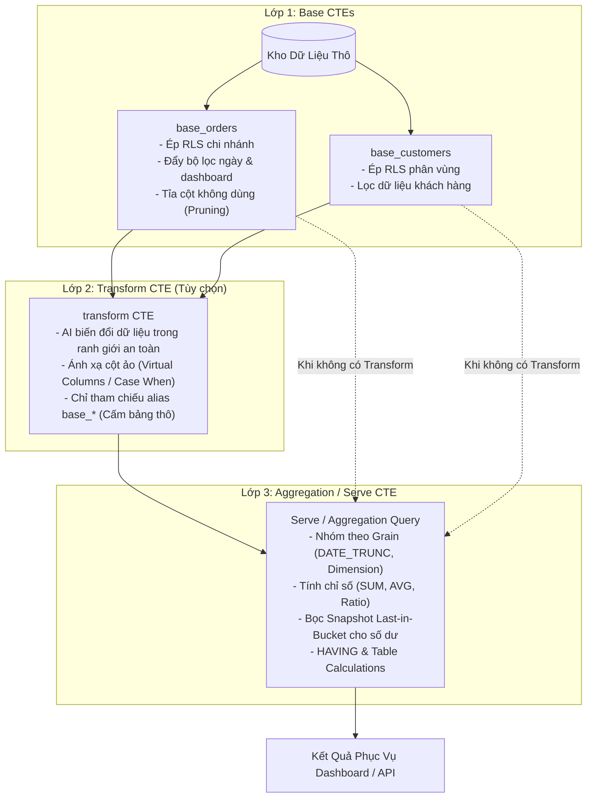

# Kiến Trúc Compiler 3 Lớp (Three-Layer Architecture)

> **Phạm vi tài liệu:** Chuyên sâu kỹ thuật về hệ thống biên dịch truy vấn SQL Semantic Core của Semantix.  
> **Áp dụng cho:** Core Engine, Query Compiler, Semantic Layer, Dashboard Data Serving.

---

## 1. Tổng Quan & Triết Lý Thiết Kế

Trong các hệ thống BI truyền thống và các công cụ Text-to-SQL thế hệ đầu, việc sinh SQL thường dựa trên kỹ thuật **bọc ngoài truy vấn (query wrapping)** hoặc nối chuỗi đơn giản. Khi người dùng áp dụng bộ lọc dashboard hoặc phân quyền dòng (RLS), hệ thống thường gom toàn bộ câu truy vấn do AI sinh vào một khối con rồi bọc mệnh đề `WHERE` ở ngoài cùng:

```sql
-- Kỹ thuật cũ (Query Wrapping) - Tiềm ẩn nhiều lỗi nghiêm trọng
SELECT * FROM (
    -- Truy vấn do AI sinh hoặc gộp sẵn
    SELECT branch_code, AVG(order_value) as avg_val FROM orders GROUP BY branch_code
) sub
WHERE region IN ('HN', 'HCM');
```

Cách tiếp cận này bộc lộ những khiếm khuyết chết người khi triển khai ở quy mô doanh nghiệp:
1. **Lỗi lọc-sau-gộp (Post-Aggregation Filtering):** Áp dụng bộ lọc sau khi dữ liệu đã được tổng hợp, phá vỡ tính đúng đắn của các chỉ số không có tính cộng dồn (non-additive metrics).
2. **Hiện tượng nhân dòng (Fan-out Join):** Khi nối bảng 1-N (ví dụ: Đơn hàng nối Chi tiết đơn hàng), dữ liệu doanh thu của đơn hàng bị nhân đôi/nhân ba trước khi tính tổng.
3. **Lỗ hổng bảo mật RLS:** Phân quyền dữ liệu (RLS) bọc ngoài dễ bị vô hiệu hóa hoặc gây lỗi cú pháp nếu câu truy vấn bên trong có mệnh đề phức tạp (`UNION`, `GROUP BY`, `WINDOW FUNCTION`).

Để giải quyết triệt để các vấn đề trên, Semantix phát triển **Kiến trúc Compiler 3 Lớp (Base → Transform → Agg)**.



---

## 2. Chi Tiết Các Lớp Trong Kiến Trúc

### 2.1. Lớp 1: Base CTE — Trích Xuất, Cắt Lát & Ép Bảo Mật

Lớp Base là tuyến phòng thủ đầu tiên và quan trọng nhất. Mỗi bảng trong mô hình dữ liệu (`BaseTable`) được biên dịch thành một CTE độc lập có tiền tố `base_<alias>`.

#### Các cơ chế cốt lõi trong Lớp Base:

1. **Ép RLS Fail-Closed ngay tại nguồn:**
   - Điều kiện Row-Level Security của người dùng (ví dụ: `branch_code = 'CN_HCM'`) được chèn **trực tiếp vào mệnh đề `WHERE` của từng CTE Base**.
   - Bảng nào chứa cột RLS thì CTE bảng đó nhận điều kiện; bảng nào không có thì bỏ qua một cách an toàn.
   - Không còn tình trạng bọc ngoài lỏng lẻo (`wrapSqlWithRls`) dễ bị né qua `UNION` hay subquery.
   
2. **Đẩy bộ lọc Dashboard (Filter Pushdown):**
   - Mọi bộ lọc toàn cục từ dashboard (khoảng ngày `RuntimeDateRange`, bộ lọc danh mục `RuntimeFilter`) được phân tích và đẩy sâu vào CTE Base của bảng sở hữu cột.
   - Nhờ đó, việc lọc dữ liệu diễn ra **trước khi** gộp dòng, bảo toàn tính toán thống kê.

3. **Ghim và tỉa phân vùng (Partition Pruning):**
   - Đối với các kho dữ liệu dạng cột (BigQuery, Snowflake, ClickHouse), compiler hỗ trợ tối ưu hóa chi phí quét bằng cách nhận diện cột phân vùng và ghim điều kiện ngày (`pinLatestPartition`), tránh Full Table Scan tốn kém.

4. **Tỉa cột không sử dụng (Unused Column Pruning):**
   - Thay vì sinh `SELECT * FROM table`, compiler duyệt qua toàn bộ cây biểu thức của Lớp Transform và Lớp Agg để xác định danh sách tối thiểu các cột thực sự cần thiết (dimension, cột tính metric, cột lọc, khóa join).
   - Chỉ các cột này được đưa vào `SELECT` của Base CTE. Việc này giảm đáng kể I/O mạng và bộ nhớ trên Data Warehouse.

```sql
-- Ví dụ Lớp Base biên dịch trên PostgreSQL
WITH base_orders AS (
    SELECT 
        id, 
        customer_id, 
        order_date, 
        amount, 
        branch_code
    FROM sales.orders
    WHERE branch_code = 'HN'                          -- Ép RLS
      AND order_date >= DATE '2026-01-01'              -- Đẩy bộ lọc ngày
      AND order_date <= DATE '2026-03-31'
      AND status IN ('PAID', 'COMPLETED')              -- Bộ lọc dashboard
),
base_customers AS (
    SELECT 
        id, 
        segment, 
        region
    FROM core.customers
    WHERE region = 'Mien_Bac'
)
```

---

### 2.2. Lớp 2: Transform CTE — AI Tự Do Trong Hàng Rào An Toàn

Lớp Transform là nơi diễn ra các phép xử lý dữ liệu phức tạp: nối bảng nhiều bước, tính toán cột ảo (`CASE WHEN`), phân cụm RFM, cohort, hoặc các phép tính cửa sổ (`WINDOW FUNCTION`).

#### Ranh giới an toàn (Guardrails):
- **Chỉ tham chiếu Base:** Toàn bộ các định danh trong mệnh đề `FROM` và `JOIN` của Transform bắt buộc phải là alias `base_*` đã khai báo ở Lớp 1 hoặc CTE phụ trợ do chính Transform định nghĩa.
- **Từ chối truy cập bảng vật lý (`TRANSFORM_PHYSICAL_TABLE_REF`):** Nếu AI cố tình viết `FROM orders` thay vì `FROM base_orders`, compiler sẽ chặn ngay lập tức. Điều này đảm bảo không một truy vấn nào có thể bỏ qua RLS và bộ lọc thời gian.
- **Read-Only nghiêm ngặt (`TRANSFORM_NOT_READ_ONLY`):** Chặn đứng mọi câu lệnh thay đổi dữ liệu (`DROP`, `INSERT`, `UPDATE`, `ALTER`, `EXECUTE`, `xp_cmdshell`...) qua 7 dialect.
- **Tự động gọt bỏ phân trang ngoài cùng (`TRANSFORM_ORDER_LIMIT_STRIPPED`):** Các mệnh đề `ORDER BY`, `LIMIT`, `TOP` ở tầng ngoài cùng của Transform sẽ được compiler tự động loại bỏ để nhường quyền sắp xếp và phân trang cho Lớp 3 (Agg).

#### Cơ chế Dry-run xác thực schema:
Khi câu truy vấn Transform hợp lệ về cú pháp, compiler có thể chạy một truy vấn thử nghiệm (`dryRunSql`) với mệnh đề `LIMIT 0` (hoặc `TOP 0` trên MSSQL) để lấy thông tin kiểu dữ liệu chính xác (`outputColumns`) từ engine database mà không quét dòng dữ liệu thực tế nào.

```sql
-- Ví dụ Lớp Transform kết hợp 2 Base CTE
transform AS (
    SELECT 
        o.id AS order_id,
        o.order_date,
        o.amount,
        c.segment,
        CASE 
            WHEN o.amount >= 10000000 THEN 'VIP'
            WHEN o.amount >= 2000000 THEN 'STANDARD'
            ELSE 'MASS'
        END AS customer_tier
    FROM base_orders o
    LEFT JOIN base_customers c ON o.customer_id = c.id
)
```

---

### 2.3. Lớp 3: Serve / Aggregation CTE — Tính Toán & Phục Vụ Chỉ Số

Lớp Aggregation chuyển đổi dữ liệu từ Lớp Transform (hoặc trực tiếp từ các Lớp Base nếu không có Transform) thành tập kết quả cuối cùng phục vụ cho biểu đồ dashboard, scorecard hoặc API.

#### 1. Xử lý Grain và Cắt Lát Thời Gian:
Tự động áp dụng các hàm cắt thời gian chuẩn hóa theo từng dialect:
- PostgreSQL: `DATE_TRUNC('month', order_date)`
- BigQuery: `DATE_TRUNC(order_date, MONTH)`
- MySQL: `DATE_FORMAT(order_date, '%Y-%m-01')`
- Snowflake / DuckDB / ClickHouse: Cú pháp tương ứng theo adapter.

#### 2. Xử lý Chỉ Số Số Dư (Snapshot Last-in-Bucket):
Đối với các chỉ số dạng số dư (dư nợ tín dụng, tồn kho, số dư tiền gửi):
- **Bẫy nghiệp vụ:** Dư nợ ngày 31/01 là 10 tỷ, ngày 28/02 là 12 tỷ. Khi xem báo cáo theo Quý, **không được lấy 10 + 12 = 22 tỷ**, mà phải lấy giá trị tại **ngày chốt cuối cùng trong kỳ (bucket)**.
- Compiler 3 lớp tự động bọc công thức:
  $$\text{SUM}(\text{CASE WHEN } \text{ngày\_chốt} = \text{MAX}(\text{ngày\_chốt trong bucket}) \text{ THEN giá\_trị END})$$
- Đảm bảo tính toán chính xác tuyệt đối mà không đòi hỏi người dùng phải viết subquery phức tạp.

#### 3. Table Calculations (23 Phép Tính Hậu Kỳ):
Các phép tính như: Running Total (Tổng lũy kế), Percent of Total (Tỷ trọng %), Difference from Previous, Moving Average, Rank... được thực thi sau khi nhận dữ liệu từ database, đảm bảo hiệu năng và tính linh hoạt hiển thị.

```sql
-- Ví dụ Lớp Aggregation hoàn chỉnh
SELECT 
    DATE_TRUNC('month', order_date) AS order_month,
    segment,
    SUM(amount) AS total_revenue,
    COUNT(DISTINCT order_id) AS unique_orders,
    SUM(amount) / NULLIF(COUNT(DISTINCT order_id), 0) AS aov
FROM transform
GROUP BY 1, 2
HAVING SUM(amount) > 0
ORDER BY order_month DESC, total_revenue DESC
LIMIT 100;
```

---

## 3. Lý Do Kỹ Thuật: Giải Quyết Triệt Để 3 Vấn Đề Lớn

| Vấn đề | Cách BI truyền thống xử lý | Hậu quả | Giải pháp của Compiler 3 Lớp |
|---|---|---|---|
| **Non-additive Metrics** (Tỷ lệ, AVG, Trung vị) | Bọc filter ở ngoài cùng câu `SELECT * FROM (subquery)` | Lỗi trung bình của trung bình (Simpson's Paradox), sai lệch số liệu báo cáo | Đẩy toàn bộ filter vào Base CTE; Aggregation luôn tính trên tập dữ liệu thô đã lọc. |
| **Fan-out Join** (Nhân dòng khi JOIN 1-N) | Viết JOIN tự do trong truy vấn | SUM doanh thu bảng `orders` bị nhân lên nhiều lần khi JOIN với `order_items` | Phát hiện rủi ro fan-out qua `hasFanOutRisk`; tách tầng aggregate hoặc khuyến nghị dùng quan hệ chuẩn. |
| **Bảo mật RLS** (Row-Level Security) | Dán chuỗi `WHERE branch = 'x'` ở cuối truy vấn | Bị vượt qua dễ dàng bởi `UNION`, `CTE`, hoặc làm vỡ câu lệnh SQL | Ép RLS trực tiếp vào từng Base CTE tương ứng theo nguyên tắc **Fail-Closed**. |

---

## 4. Cơ Chế Vận Hành: Shadow Mode & Serve Mode

Để đảm bảo việc chuyển đổi sang Compiler 3 Lớp không gây gián đoạn hay sai lệch dữ liệu trên các dashboard đang chạy thực tế, Semantix thiết kế quy trình triển khai qua 2 chế độ cờ môi trường:

### 4.1. Chế Độ Shadow Mode (`THREE_LAYER_SHADOW=1`)

- **Nguyên lý:** Dashboard vẫn nhận và hiển thị dữ liệu từ Query Engine cũ (Strategy A).
- **Chạy ngầm (Fire-and-Forget):** Song song với luồng chính, hệ thống âm thầm biên dịch spec thành SQL 3 lớp và thực thi trên database.
- **Đối soát từng ô (Cell-by-Cell Reconciliation):**
  - So sánh kết quả của 2 đường truy vấn với sai số số thực $\epsilon = 10^{-6}$.
  - Ghi log JSON có tiền tố `[three_layer_shadow]` với các trạng thái: `match`, `mismatch`, `grain_differs`, hoặc `exec_error`.
  - Nếu có sự sai lệch (mismatch), hệ thống tự động lưu 5 dòng sai lệch tiêu biểu cùng câu lệnh SQL của 2 bên để đội ngũ kỹ thuật phân tích.
- **Không ảnh hưởng trải nghiệm:** Luồng shadow chạy hoàn toàn độc lập, có timeout riêng, không làm tăng thời gian phản hồi của dashboard.

### 4.2. Chế Độ Phục Vụ Trực Tiếp — Serve Mode (`THREE_LAYER_SERVE=1`)

Khi các dashboard đã đạt tỷ lệ khớp 100% trong Shadow Mode, quản trị viên kích hoạt Serve Mode để phục vụ trực tiếp:

1. **Phân phối theo danh sách (`THREE_LAYER_SERVE_DASHBOARDS`):**
   - Cho phép bật cho từng dashboard cụ thể (danh sách ID phân tách bằng dấu phẩy) hoặc bật toàn bộ (`*`).
2. **Thực thi duy nhất một truy vấn:**
   - Database chỉ phải chạy đúng câu lệnh SQL biên dịch 3 lớp, tối ưu tài nguyên và tốc độ tải trang.
   - Metadata phản hồi đánh dấu rõ `servedBy: "three_layer"`.
3. **Cơ chế xác thực đồng thời (`THREE_LAYER_SERVE_VERIFY=1`):**
   - Khi cần kiểm thử trên môi trường Staging/UAT: Dashboard phục vụ bằng kết quả của Compiler 3 Lớp, đồng thời chạy đường cũ để ghi log verify xem có bất kỳ sự trôi lệch dữ liệu nào không.
4. **Fallback An Toàn Tuyệt Đối (Fail-Closed):**
   - Nếu phát hiện bất kỳ dấu hiệu bất thường nào (cột widget không khớp với spec, RLS không thể gán vào bảng nào, lỗi cú pháp dry-run), hệ thống **ngay lập tức rơi về đường cũ** và ghi log `status: "fallback"`. Người dùng cuối không bao giờ nhìn thấy màn hình trắng hoặc lỗi hệ thống.

---

## 5. Cấu Trúc Spec 3 Lớp (ThreeLayerSpec)

Hợp đồng dữ liệu giữa AI và Compiler được chuẩn hóa thông qua Zod Schema (`lib/semantic/three-layer/spec.ts`):

```json
{
  "version": 1,
  "base": {
    "tables": [
      { "alias": "o", "table": "orders" },
      { "alias": "c", "table": "customers", "joinRole": "nullSupplying", "filterMode": "scope" }
    ],
    "joins": [
      { "left": "o", "right": "c", "type": "left", "on": "o.customer_id = c.id" }
    ]
  },
  "transform": {
    "alias": "transform",
    "sql": "SELECT o.id, o.amount, o.order_date, c.region FROM base_o o LEFT JOIN base_c c ON o.customer_id = c.id"
  },
  "agg": {
    "columns": [
      { "kind": "dimension", "sourceColumn": "region", "outputKey": "region" },
      { "kind": "metric", "sourceMetric": "total_revenue", "outputKey": "revenue" }
    ],
    "grain": "month",
    "timeColumn": "order_date"
  }
}
```

---

## 6. Tổng Kết

Kiến trúc Compiler 3 Lớp đưa Semantix trở thành nền tảng Semantic Layer tiên tiến, kết hợp hoàn hảo giữa **sự linh hoạt sinh mã của AI** và **sự chặt chẽ, an toàn của một trình biên dịch cấp doanh nghiệp**. 

Nhờ Base CTE kiểm soát RLS, Transform CTE đóng khung ranh giới và Aggregation CTE chuẩn hóa chỉ số, mọi con số hiển thị trên Dashboard đều đảm bảo tính chính xác toán học, tốc độ tối ưu và bảo mật đa tầng.
