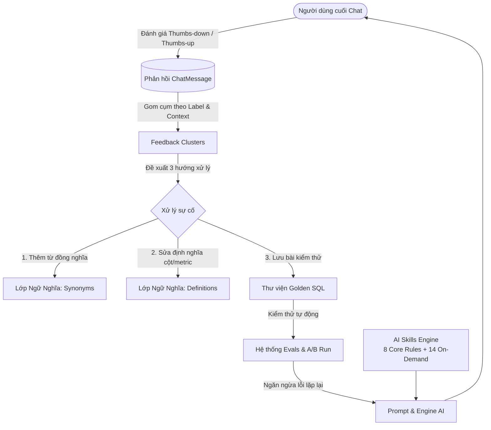

# Trung Tâm Điều Hành AI (AI Hub)

**Trung tâm Điều hành AI (AI Hub)** trong Semantix Studio là trạm chỉ huy trung tâm dành cho Quản trị viên (Admin), Kỹ sư Dữ liệu (Data Engineer), và Chuyên viên Phân tích (Analytics Engineer) nhằm kiểm soát, đo lường và nâng cao liên tục chất lượng của trợ lý AI trên toàn doanh nghiệp.

Thay vì coi AI là một "hộp đen" khó lường, AI Hub cung cấp các công cụ trực quan, minh bạch và có tính toán định lượng để đảm bảo mọi câu trả lời, truy vấn SQL và phân tích từ Semantix đều chuẩn xác, đáng tin cậy và tuân thủ chặt chẽ ngữ nghĩa nghiệp vụ.

---

## 1. Triết Lý Vận Hành Của AI Hub

Hệ thống AI Hub hoạt động dựa trên ba nguyên tắc then chốt:

1. **Minh bạch và Tự động Kiểm chứng (Trust but Verify):**
   Mọi câu trả lời của AI đều gắn liền với câu lệnh SQL, số liệu thực tế từ kho dữ liệu (Data Warehouse), dung lượng quét và chi phí. Không có bất kỳ nhận định nào được đưa ra mà thiếu bằng chứng số liệu.

2. **Vòng lặp Phản hồi Đóng (Closed Feedback Loop):**
   Mọi phản hồi tiêu cực (thumbs-down) từ người dùng cuối không bị trôi đi hay phân tán thành các dòng lẻ tẻ vô nghĩa. AI Hub tự động gom nhóm, tìm nguyên nhân gốc rễ và đề xuất hành động khắc phục cụ thể để hoàn thiện lớp ngữ nghĩa (Semantic Layer).

3. **Cơ chế Đo lường Cơ học Tất định (Deterministic Evaluation):**
   Chất lượng của mô hình và câu truy vấn được kiểm thử tự động với bộ chuẩn **Golden SQL**. Thay vì dùng một LLM khác để "chấm điểm cảm tính", hệ thống đối chiếu trực tiếp kết quả chạy thực tế trên cơ sở dữ liệu để tìm ra các trường hợp sai lệch (Regressions).

---

## 2. Bốn Trụ Cột Cốt Lõi Của AI Hub

AI Hub được xây dựng xung quanh bốn trụ cột chính:

### 1. Hệ Thống Kỹ Năng AI (AI Skills Registry)
- Quản lý tập trung các gói hướng dẫn nghiệp vụ và phương pháp luận phân tích.
- Phân chia thành **8 Quy tắc Cốt lõi (Core Rules)** luôn nạp ngầm để kiểm soát tư duy nghiệp vụ, tính toán thời gian, an toàn dữ liệu và bảo mật; cùng **14 Kỹ năng Theo yêu cầu (On-Demand Skills)** được kích hoạt qua menu `/` hoặc nhận diện tự động từ câu hỏi.
- Hỗ trợ xem trước prompt, đo lường token, theo dõi tần suất sử dụng (30 ngày gần nhất) và tỉ lệ hài lòng của từng kỹ năng.

> Xem chi tiết tại: [Quản Lý Kỹ Năng AI (Skills Registry)](skills.md)

### 2. Vòng Lặp Phản Hồi & Gom Cụm Đề Xuất (Feedback Clusters)
- Tự động quét và tổng hợp hàng nghìn lượt phản hồi của người dùng thành các **Cụm Vấn Đề (Feedback Clusters)** theo ngữ cảnh ngữ nghĩa (`contextId`) và nhãn phân loại (`derivedLabel`).
- Mô hình AI tóm tắt lý do người dùng phàn nàn (*Rationale*) bằng chính ngôn ngữ của bình luận và đề xuất một hành động cụ thể (*Suggested Action*).
- Độ ưu tiên được xếp theo **số lượng hội thoại bị ảnh hưởng thực tế (`affectedCount`)**, giúp đội ngũ quản trị tập trung giải quyết những điểm nghẽn lớn nhất của dữ liệu.
- Cung cấp 3 lối thoát dứt điểm cho mỗi vấn đề: **Tạo từ đồng nghĩa**, **Sửa định nghĩa trường/chỉ số**, hoặc **Tạo bài kiểm thử Eval Case**.

> Xem chi tiết tại: [Vòng Lặp Phản Hồi & Gom Cụm Đề Xuất](feedback-loop.md)

### 3. Kiểm Thử & Đánh Giá Mô Hình (Evals)
- Nền tảng chạy kiểm thử tự động hàng loạt trường hợp truy vấn với dữ liệu thực tế trên kho dữ liệu.
- Theo dõi lịch sử thực thi (`EvalRun` và `EvalRunCase`), tính toán tỷ lệ chính xác (`accuracy`) qua từng phiên bản model hoặc thay đổi cấu hình ngữ nghĩa.
- So sánh trực quan A/B giữa hai lần chạy: Ưu tiên xếp các ca **"Bị làm hỏng" (Broken / Regressions)** lên đầu tiên trước các ca "Đã sửa được" (Fixed).
- Phân loại nguyên nhân gốc rễ thành 7 lỗi cơ học tất định (như sai số dòng `row_count`, sai thứ tự `row_order`, khác biệt giá trị `values_differ`, lỗi cú pháp CSDL `invalid_sql`...) mà không cần LLM phán xét.

> Xem chi tiết tại: [Kiểm Thử & Đánh Giá Mô Hình (Evals)](evals.md)

### 4. Thư Viện Golden SQL (Golden SQL Library)
- Lưu trữ các cặp câu hỏi tự nhiên và câu lệnh SQL chuẩn mực đã được chuyên gia dữ liệu thẩm định, chạy thử nghiệm và xác nhận chính xác.
- Lưu trữ đồng thời cả câu lệnh SQL và cấu trúc `QueryIntent` JSON giúp tầng trích xuất ý định của AI học chuẩn xác cấu trúc phân rã metric/dimension.
- Hỗ trợ ghim các câu hỏi tiêu biểu (`isPinned`) để đưa trực tiếp vào Few-Shot Prompt của mô hình, giúp AI luôn tuân thủ các quy ước nghiệp vụ đặc thù của doanh nghiệp.

> Xem chi tiết tại: [Quản Lý Golden SQL](golden-sql.md)

---

## 3. Bảng Điều Khiển Tổng Quan (Overview Dashboard)

Khi truy cập vào `/admin/ai-hub`, tab **Tổng quan (Overview)** cung cấp bức tranh toàn cảnh về sức khỏe của hệ thống AI trong 30 ngày qua:

| Chỉ số | Ý nghĩa & Cách tính | Hành động khuyến nghị |
|---|---|---|
| **Tỷ lệ Hài lòng (Satisfaction Rate)** | `%` lượt đánh giá tích cực (`thumbs-up / (thumbs-up + thumbs-down)`). Trả về `—` nếu chưa có đánh giá nào. | Nếu tỷ lệ < 85%, cần rà soát ngay các Cụm phản hồi mở trong tab Gợi ý. |
| **Phản hồi âm chưa xử lý (Unresolved Negative)** | Số lượt đánh giá tiêu cực chưa có hành động khắc phục (chưa tạo synonym, chưa sửa definition, chưa tạo eval case). **Số liệu này không giới hạn theo 30 ngày.** | Duy trì chỉ số này về 0. Một câu trả lời sai từ 2 tháng trước nếu chưa ai sửa vẫn là một lỗi tồn đọng. |
| **Chưa được gắn nhãn (Unlabelled)** | Các bình luận dài (≥ 8 ký tự) nhưng chưa được bộ phân loại gán nhãn chủ đề. | Chạy lệnh gom cụm để AI tự động phân tích và gán nhãn. |
| **Độ chính xác Evals (Eval Accuracy)** | Tỷ lệ phần trăm các ca kiểm thử đạt kết quả đúng trên tổng số ca chạy trong phiên gần nhất. | Phải đảm bảo đạt 100% trước khi triển khai các thay đổi lớn về Data Model hoặc Prompt. |
| **Chi phí & Lượt gọi (Cost & Calls)** | Tổng chi phí ước tính (USD) và số lượt gọi AI thực tế trong 30 ngày qua. | Theo dõi để phát hiện các truy vấn tốn kém đột biến hoặc vượt định mức token. |
| **Nhãn Nổi Cộm (Hot Labels)** | Top 5 nhãn phàn nàn xuất hiện nhiều nhất (kèm mũi tên xu hướng so với chu kỳ trước). | Bấm trực tiếp vào nhãn để lọc ngay danh sách các hội thoại liên quan trong tab Chất lượng. |

---

## 4. Quyền Hạn Quản Trị (RBAC Permissions)

Để thao tác trên AI Hub, người dùng cần được cấp các quyền tương ứng trong hệ thống phân quyền của Semantix:

- `view_feedback`: Xem danh sách phản hồi, đọc thống kê AI Hub Overview, xem chi tiết đánh giá chất lượng.
- `edit_suggestion`: Quản lý các cụm phản hồi (triage, đổi trạng thái sang in_progress/resolved/dismissed), chạy lại quá trình gom cụm (`rebuild`).
- `manage_models` / `manage_context`: Quản lý bật/tắt kỹ năng AI (Skills), chỉnh sửa prompt ghi đè, quản lý Golden SQL và chạy Evals.

---

## 5. Tiếp Theo

Khám phá chi tiết từng phân hệ của AI Hub:
- [Quản lý Kỹ năng AI (Skills Registry)](skills.md)
- [Vòng lặp Phản hồi & Gom cụm Đề xuất (Feedback Clusters)](feedback-loop.md)
- [Kiểm thử & Đánh giá Mô hình (Evals)](evals.md)
- [Quản lý Golden SQL (Golden SQL Library)](golden-sql.md)
- [Cấu hình AI Providers & Google Vertex AI](../ai-providers.md)
