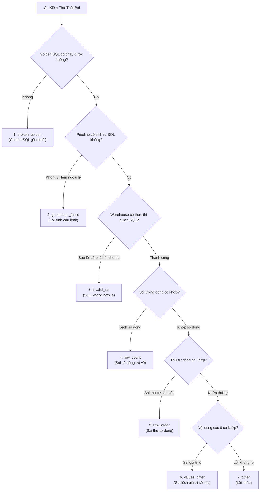

# Kiểm Thử & Đánh Giá Mô Hình (Evals)

Hệ thống **Kiểm Thử & Đánh Giá (Evals)** trong Semantix Studio là chốt chặn kỹ thuật bảo đảm AI không bị thoái hóa chất lượng (Regression) khi cập nhật prompt, đổi mô hình ngôn ngữ lớn (LLM), hoặc chỉnh sửa mô hình dữ liệu ngữ nghĩa (Semantic Context).

Trong phân tích dữ liệu doanh nghiệp, chỉ một thay đổi nhỏ về logic SQL cũng có thể dẫn đến sai lệch hàng tỷ đồng trong báo cáo tài chính. Hệ thống Evals của Semantix giúp tự động hóa quá trình kiểm thử chất lượng truy vấn, đối chiếu kết quả thực tế trên cơ sở dữ liệu và phát hiện ngay lập tức các trường hợp bị lỗi.

---

## 1. Kiến Trúc Kiểm Thử Evals: `EvalRun` & `EvalRunCase`

Hệ thống đánh giá được tổ chức thành hai thực thể chính:

1. **`EvalRun` (Phiên Chạy Kiểm Thử):**
   - Đại diện cho một lần thực thi toàn bộ bộ kiểm thử trên một Ngữ cảnh dữ liệu (`contextId`).
   - Lưu trữ siêu dữ liệu: Thời điểm bắt đầu/hoàn tất, người kích hoạt, mô hình LLM được sử dụng, nhãn phiên chạy, tỷ lệ chính xác tổng thể (`accuracy`), số ca thành công (`passedCount`), số ca thất bại (`failedCount`).

2. **`EvalRunCase` (Từng Ca Kiểm Thử Cụ Thể):**
   - Mỗi ca kiểm thử ứng với một câu hỏi trong bộ **Golden SQL** của ngữ cảnh đó.
   - Trình chạy (Runner) sẽ đưa câu hỏi tự nhiên qua pipeline của Semantix để sinh ra câu lệnh SQL ứng viên (Candidate SQL).
   - Chạy cả **Golden SQL** và **Candidate SQL** trên cùng một kho dữ liệu thật, sau đó đối chiếu kết quả trả về bằng module so sánh ma trận (`compareResultSets`).
   - Ghi lại trạng thái (`passed` hoặc `failed`), thời gian thực thi, câu lệnh SQL sinh ra, và phân loại nguyên nhân gốc rễ (`rootCause`).

---

## 2. So Sánh Trực Quan A/B Run: Triết Lý "Regressions First"

Khi quản trị viên thay đổi một prompt hệ thống hoặc tinh chỉnh định nghĩa chỉ số, làm sao để biết phiên bản mới tốt hơn hay tệ hơn phiên bản cũ? 

Semantix cung cấp tính năng **So Sánh Hai Phiên Chạy A/B (Run Comparison)** tại `/admin/ai-hub/evals/[contextId]`. Bạn chỉ cần chọn một phiên Base (gốc) và một phiên Head (mới), hệ thống sẽ phân tách kết quả thành 3 nhóm rõ rệt:

```
┌────────────────────────────────────────────────────────────────────────────────────────┐
│ SO SÁNH PHIÊN CHẠY: [Base: Run #12 (92%)] ──→ [Head: Run #13 (94%)]                   │
├────────────────────────────────────────────────────────────────────────────────────────┤
│ ❌ BỊ LÀM HỎNG (BROKEN / REGRESSIONS) · 1 ca                                            │
│   • "Doanh thu bán lẻ theo khu vực tháng trước"                                        │
│     Lý do: Row count differs: expected 5, got 0 (Candidate SQL failed to execute)      │
├────────────────────────────────────────────────────────────────────────────────────────┤
│ ✅ ĐÃ SỬA ĐƯỢC (FIXED) · 2 ca                                                          │
│   • "Top 10 khách hàng có số dư tiền gửi cao nhất"                                     │
│   • "Tỷ lệ nợ xấu quý 2 theo từng chi nhánh"                                           │
├────────────────────────────────────────────────────────────────────────────────────────┤
│ ⚠️ VẪN ĐANG HỎNG (STILL FAILING) · 1 ca                                                │
│   • "Khách hàng mở thẻ tín dụng nhưng chưa kích hoạt"                                   │
└────────────────────────────────────────────────────────────────────────────────────────┘
```

### Triết lý "Regressions First" (Bị làm hỏng xếp trước):
> *"Three fixes and one break is not a win until someone has looked at the one."*  
> *(Sửa được 3 câu nhưng làm hỏng mất 1 câu thì KHÔNG PHẢI là một thắng lợi, cho đến khi có người vào xem kỹ câu bị hỏng đó.)*

Trong nhiều công cụ đánh giá AI, giao diện thường tôn vinh số ca "Đã sửa được" bằng màu xanh rực rỡ và giấu các ca "Bị làm hỏng" xuống cuối. Semantix làm ngược lại:
- Nhóm **Bị làm hỏng (Broken / Regressions)** luôn được **xếp ở vị trí ĐẦU TIÊN** với tông màu đỏ cảnh báo.
- Người quản trị bắt buộc phải thẩm định câu bị làm hỏng xem đó có phải là một chức năng cốt lõi bị phá vỡ hay không trước khi quyết định đưa cấu hình mới lên môi trường Production.

---

## 3. 7 Phân Loại Nguyên Nhân Gốc Rễ Cơ Học Tất Định

Một sai lầm phổ biến của các công cụ AI Evals trên thị trường là sử dụng một LLM khác (LLM-as-a-judge) để đọc lỗi và viết lời nhận xét. Semantix **nói KHÔNG với LLM judge** cho các lỗi kiểm thử SQL vì:
- Việc câu lệnh SQL bị lỗi cú pháp, trả về thiếu dòng, hay lệch số là một **sự thật cơ học (mechanical fact)** mà hệ thống so sánh kết quả đã biết chính xác 100%.
- Bắt LLM đọc lại chỉ làm tốn thêm chi phí API, gây chậm trễ và có thể sinh ra ảo giác mới.

Do đó, Semantix xây dựng cây phân loại **7 Nguyên Nhân Gốc Rễ Tất Định (`EvalRootCause`)** được suy ra trực tiếp từ lý do kỹ thuật của runner:



### Bảng Chi Tiết 7 Nguyên Nhân Gốc Rễ:

| Mã Nguyên Nhân | Tên Hiển Thị | Bản Chất Kỹ Thuật & Cách Khắc Phục |
|---|---|---|
| `broken_golden` | **Golden SQL lỗi** | Bản thân câu lệnh Golden SQL mẫu đã không chạy được trên kho dữ liệu (do bảng nguồn bị xóa, đổi tên cột trong database, hoặc bài test bị viết sai).<br/>👉 **Cách sửa:** Sửa lại câu Golden SQL mẫu trong thư viện, không cần sửa mô hình AI. |
| `generation_failed` | **Không sinh được SQL** | Pipeline của AI ném ngoại lệ hoặc trả về rỗng; không có câu lệnh SQL nào được tạo ra để gửi tới cơ sở dữ liệu.<br/>👉 **Cách sửa:** Kiểm tra log hệ thống, kiểm tra giới hạn token hoặc kiểm tra lỗi kết nối AI Provider. |
| `invalid_sql` | **SQL không hợp lệ** | AI sinh ra câu lệnh SQL nhưng kho dữ liệu từ chối thực thi (lỗi cú pháp dialect, gọi hàm không tồn tại, sai kiểu dữ liệu).<br/>👉 **Cách sửa:** Bổ sung dialect hint trong context hoặc thêm ví dụ Golden SQL chuẩn cú pháp. |
| `row_count` | **Lệch số dòng** | Câu lệnh SQL ứng viên chạy thành công nhưng trả về số dòng khác với Golden SQL (ví dụ: Golden trả 10 dòng, AI trả 100 dòng hoặc 0 dòng).<br/>👉 **Cách sửa:** Thiếu mệnh đề `LIMIT`, sai điều kiện lọc `WHERE`, hoặc gặp lỗi fan-out khi JOIN. |
| `row_order` | **Sai thứ tự dòng** | Cùng số dòng và dữ liệu nhưng thứ tự dòng không khớp trong một truy vấn nhạy thứ tự (ví dụ: yêu cầu Top 5 doanh thu nhưng quên `ORDER BY revenue DESC`).<br/>👉 **Cách sửa:** Nhắc AI quy tắc sắp xếp giảm dần cho các câu hỏi Top N. |
| `values_differ` | **Khác biệt giá trị** | Kích thước bảng và cột khớp nhau nhưng các con số bên trong bị sai khác (ví dụ: Golden trả 1.500.000, AI trả 1.200.000).<br/>👉 **Cách sửa:** Kiểm tra lại công thức tính của Metric hoặc điều kiện loại trừ đơn hủy/hoàn. |
| `other` | **Lỗi khác** | Các lỗi biên chưa được định danh rõ ràng trong runner. |

---

## 4. Bảng Phân Bổ Nguyên Nhân Gốc Rễ (Root Cause Breakdown)

Trong báo cáo so sánh A/B, ngay bên dưới danh sách ca kiểm thử là khối **Phân bổ Nguyên nhân Gốc rễ (Root Cause Breakdown)**:

```
NGUYÊN NHÂN GỐC RỄ (PHIÊN B)
[ SQL không hợp lệ · 3 ]  [ Lệch số dòng · 2 ]  [ Khác biệt giá trị · 1 ]
```

Nhờ các huy hiệu thống kê này, đội ngũ kỹ sư không phải phỏng đoán: Nếu thấy `invalid_sql` chiếm đa số, vấn đề nằm ở cú pháp SQL; nếu thấy `broken_golden`, vấn đề nằm ở dữ liệu kho mẫu; nếu thấy `row_count`, vấn đề nằm ở bộ lọc hoặc logic JOIN.

---

## 5. Quy Trình Chạy Evals Khuyến Nghị Trước Khi Triển Khai

Để đảm bảo an toàn tuyệt đối cho hệ thống trợ lý dữ liệu:

1. **Bước 1 — Thiết lập Suite:** Xây dựng tối thiểu 20–50 ca Golden SQL đại diện cho các câu hỏi sống còn của doanh nghiệp.
2. **Bước 2 — Chạy Base Run:** Chạy một phiên EvalRun trên phiên bản hiện tại để ghi nhận mốc độ chính xác ban đầu (ví dụ: 90%).
3. **Bước 3 — Thực hiện Thay đổi:** Cập nhật System Prompt, nạp thêm Kỹ năng (Skill), hoặc tinh chỉnh Semantic Context.
4. **Bước 4 — Chạy Head Run:** Kích hoạt phiên EvalRun mới trên cấu hình vừa cập nhật.
5. **Bước 5 — So sánh A/B:** Bấm nút **So sánh phiên chạy (Compare Runs)**. Kiểm tra mục **Bị làm hỏng (Broken)**: Nếu có bất kỳ ca nào rơi vào nhóm này, **tuyệt đối không deploy** cho đến khi nguyên nhân gốc rễ được khắc phục.
