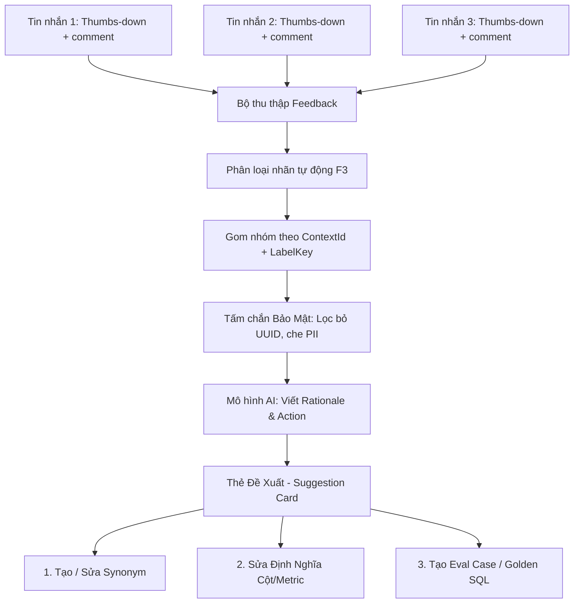

# Vòng Lặp Phản Hồi & Gom Cụm Đề Xuất (Feedback Loop & Clusters)

Một trong những thách thức lớn nhất khi vận hành trợ lý dữ liệu AI trong doanh nghiệp là **xử lý phản hồi tiêu cực**. Khi người dùng bấm Thumbs-down kèm lời phàn nàn ("số doanh thu này sai", "không hiểu khách hàng VIP là gì", "cột này tính thiếu hoàn trả"), các hệ thống truyền thống thường hiển thị hàng trăm dòng phản hồi đơn lẻ. Hậu quả là:
- Đội ngũ quản trị bị ngập trong một "đống rác" phản hồi rời rạc.
- Không biết vấn đề nào đang ảnh hưởng nghiêm trọng nhất để ưu tiên sửa.
- Không hiểu lý do tại sao người dùng phàn nàn nếu không mở từng cuộc trò chuyện để đọc lại toàn bộ ngữ cảnh.

Semantix giải quyết triệt để bài toán này bằng **Vòng Lặp Phản Hồi Đóng (Closed Feedback Loop)** và công nghệ **Gom Cụm Phản Hồi (`FeedbackCluster`)**.

---

## 1. Cơ Chế Gom Cụm Phản Hồi (Feedback Clusters)

Thay vì xem từng dòng đơn lẻ, Semantix tự động gom nhóm hàng nghìn phản hồi của người dùng thành một danh sách ngắn các vấn đề đáng giá để giải quyết.



### 1.1 Nguyên Tắc Gom Nhóm Hai Tầng
1. **Tầng 1 — Gom cơ học (Deterministic Grouping):**
   Hệ thống nhóm các phản hồi theo cặp `contextId` (Ngữ cảnh dữ liệu) và `labelKey` (Nhãn vấn đề được trích xuất tự động từ bình luận). Quá trình này **hoàn toàn cơ học, không tốn chi phí gọi LLM**.
2. **Tầng 2 — Trích xuất bản chất nghiệp vụ (AI Insight Generation):**
   Với mỗi cụm vấn đề, LLM được yêu cầu đọc tối đa 10 bình luận đại diện (`SAMPLE_COMMENTS`) để viết:
   - **Lý do (Rationale):** 2–3 câu giải thích điểm chung của các phàn nàn và nguyên nhân cốt lõi xảy ra sự cố, viết bằng chính ngôn ngữ người dùng phản hồi.
   - **Hành động đề xuất (Suggested Action):** Một câu mệnh lệnh dứt khoát nêu rõ cần thay đổi cái gì trong lớp ngữ nghĩa.
   - **Đối tượng nghi vấn (Target Field):** Chỉ ra chính xác Cột (Column) hoặc Chỉ số (Metric) có khả năng gây lỗi cao nhất.

### 1.2 Bảo Mật Tuyệt Đối (Privacy & Guardrails)
Khi gọi mô hình để viết Rationale, Semantix áp dụng các quy chuẩn bảo mật nghiêm ngặt:
- **Không để lộ ID nội bộ:** Danh sách trường ứng viên (`loadCandidateFields`) chỉ cung cấp tên hiển thị của Cột và Metric (`displayName || name`). Tuyệt đối không gửi UUID của bảng, cột hay ID cơ sở dữ liệu cho mô hình.
- **Bọc dữ liệu không tin cậy (`wrapUntrustedData`):** Bình luận của người dùng được bọc qua lớp bảo vệ để triệt tiêu mọi nỗ lực prompt injection ẩn trong phản hồi.

### 1.3 Ngân Sách Định Mức Khi Tái Xây Dựng (`rebuildFeedbackClusters`)
- Để tránh chi phí LLM tăng vọt ngoài tầm kiểm soát, mỗi lần bấm **Quét lại (Rebuild)**, hệ thống chỉ gọi LLM cho tối đa **10 cụm vấn đề chưa có Rationale (`DEFAULT_INSIGHT_BUDGET = 10`)**, ưu tiên những cụm có số hội thoại bị ảnh hưởng nhiều nhất.
- Những cụm đã có Rationale từ trước sẽ được giữ nguyên và cập nhật lại số lượng hội thoại miễn phí.

---

## 2. Thẻ Đề Xuất (Suggestion Card) & Độ Ưu Tiên Thực Tế

Trong giao diện `/admin/ai-hub/suggestions`, mỗi cụm vấn đề được hiển thị dưới dạng một **Thẻ Đề Xuất (Suggestion Card)** trực quan:

```
┌────────────────────────────────────────────────────────────────────────────────────────┐
│ [ Nhãn: Chưa định nghĩa doanh thu thuần ]  [ Trạng thái: Mở ]    Context: Bán lẻ NCB   │
│                                                               💬 Ảnh hưởng: 18 hội thoại│
├────────────────────────────────────────────────────────────────────────────────────────┤
│ Rationale: Người dùng liên tục hỏi về doanh thu thuần và chiết khấu bán hàng nhưng AI  │
│ hiểu nhầm sang tổng doanh thu gộp do thiếu công thức trừ giảm trừ doanh thu.           │
│                                                                                        │
│ → Sửa công thức metric Net Revenue bằng cách lấy Total Revenue trừ đi Discount.       │
│                                                                                        │
│ 🎯 Chỉ số liên quan: Doanh thu thuần (net_revenue)                                      │
├────────────────────────────────────────────────────────────────────────────────────────┤
│ [ Xem 18 hội thoại ]              [ 3 Lối Thoát Xử Lý ]             [ Phân loại ▼ ]   │
└────────────────────────────────────────────────────────────────────────────────────────┘
```

### Độ ưu tiên không phải là con số bịa đặt:
Độ ưu tiên của một thẻ đề xuất được đo lường chính xác bằng **Số lượng cuộc trò chuyện bị ảnh hưởng (`affectedCount`)**. Một vấn đề khiến 25 nhân sự phàn nàn trong tuần sẽ tự động nổi lên trên vấn đề chỉ có 1 người gặp phải.

---

## 3. Ba Nút Xử Lý Cụ Thể (The 3 Ways Out)

Điểm đặc biệt của Semantix là không dừng lại ở việc "đọc phàn nàn để đó". Mỗi Thẻ Đề Xuất và từng dòng phản hồi trong tab Chất lượng đều cung cấp **3 lối thoát dứt điểm** để đóng vòng lặp:

### Lối thoát 1: Tạo Từ Đồng Nghĩa (Tạo / Sửa Synonym)
- **Khi nào dùng:** Người dùng dùng các thuật ngữ kinh doanh thực tế, tiếng lóng hoặc từ viết tắt mà schema kỹ thuật chưa khai báo (ví dụ: gọi "khách sộp" thay vì "khách hàng VIP", gọi "doanh số" thay vì "tổng tiền đơn hàng").
- **Hành động:** Bấm nút **Sửa từ đồng nghĩa**, hệ thống mở hộp thoại `FeedbackFixDialog` cho phép nhập trực tiếp các từ đồng nghĩa vào Cột hoặc Metric liên quan. Lần hỏi kế tiếp, AI sẽ nhận diện chính xác 100%.

### Lối thoát 2: Sửa Định Nghĩa Cột / Metric (Fix Definition)
- **Khi nào dùng:** Câu trả lời sai vì mô tả của cột trong metadata bị mơ hồ, hiểu sai đơn vị đo (ví dụ: cột `amount` tính bằng nghìn đồng nhưng AI nghĩ là VNĐ), hoặc công thức tính metric bị thiếu điều kiện lọc.
- **Hành động:** Bấm nút **Sửa định nghĩa** (`fixDefinition`), quản trị viên được dẫn thẳng đến phần chỉnh sửa mô tả (`description`) của cột/chỉ số trong mô hình dữ liệu để bổ sung quy tắc nghiệp vụ rõ ràng.

### Lối thoát 3: Tạo Bài Kiểm Thử (Tạo Eval Case / Lưu Golden SQL)
- **Khi nào dùng:** Khi câu hỏi của người dùng rất điển hình hoặc câu trả lời trước đó bị sai nghiêm trọng.
- **Hành động:** 
  - Nếu câu trả lời có kèm SQL đúng (sau khi chuyên viên đã chỉnh sửa), bấm **Lưu vào Golden SQL**.
  - Nếu câu lệnh SQL của AI bị sai, bấm **Tạo Eval Case**. Hệ thống sẽ lưu câu hỏi này thành một ca kiểm thử hồi quy (Regression Test Case) bắt buộc trong bộ Evals. Bất cứ bản cập nhật prompt hay model nào trong tương lai làm sai câu hỏi này đều sẽ bị chặn lại.

---

## 4. Quy Trình Triage & Cơ Chế Hoàn Tác (Undo)

Mỗi Cụm Đề Xuất được quản lý qua 4 trạng thái Triage rõ ràng:

1. **Mở (`open`):** Vấn đề mới được phát hiện từ phản hồi người dùng, đang chờ xem xét.
2. **Đang xử lý (`in_progress`):** Đã giao cho Data Engineer hoặc Analytics Engineer điều chỉnh Semantic Layer.
3. **Đã giải quyết (`resolved`):** Đã hoàn tất chỉnh sửa định nghĩa, thêm synonym hoặc bổ sung Golden SQL.
4. **Bỏ qua (`dismissed`):** Các phàn nàn không hợp lệ (ví dụ: người dùng hỏi dữ liệu nằm ngoài phạm vi doanh nghiệp).

### Cơ chế Hoàn tác thông minh (Toast Undo):
Khi quản trị viên chuyển trạng thái của một thẻ (ví dụ bấm *Bỏ qua* hoặc *Đã giải quyết*), thẻ đó sẽ rời khỏi màn hình hiện tại ngay lập tức để giữ danh sách làm việc luôn tinh gọn. Tuy nhiên, một thông báo Toast sẽ xuất hiện kèm nút **Hoàn tác (Undo)** trong 5 giây, cho phép lấy lại trạng thái cũ ngay tức khắc nếu bấm nhầm.

---

## 5. Thước Đo Chỉ Số "Unresolved Negative"

Tại trang Tổng quan AI Hub, chỉ số **Phản hồi âm chưa xử lý (`unresolvedNegative`)** là thước đo danh dự của đội ngũ quản trị dữ liệu:

- Một phản hồi tiêu cực chỉ được tính là **Đã xử lý (Acted On)** khi và chỉ khi nó đi qua một trong 3 lối thoát:
  $$\text{Acted On} \iff (\text{Đã lưu Golden SQL}) \lor (\text{Đã tạo Eval Case}) \lor (\text{Đã tạo Semantic Fix})$$
- Việc chỉ mở ra xem hoặc đổi trạng thái mà không thực hiện hành động kỹ thuật sẽ **không làm giảm** chỉ số này.
- Chỉ số này **không bị giới hạn theo 30 ngày**: Một câu hỏi sai từ 3 tháng trước nếu bị bỏ quên vẫn là một món "nợ kỹ thuật" cần giải quyết.
