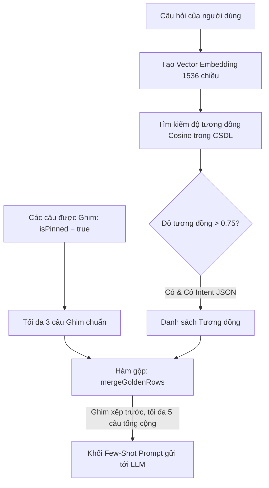

# Quản Lý Golden SQL (Golden SQL Library)

**Golden SQL** là thư viện các cặp **"Câu hỏi bằng ngôn ngữ tự nhiên — Câu lệnh SQL chuẩn mực"** đã được các chuyên gia dữ liệu (Data Engineer, Analytics Engineer) thẩm định, chạy thử nghiệm và phê duyệt trong Semantix.

Trong kiến trúc của Semantix, Golden SQL đóng vai trò kép:
1. **Bộ Đề Chuẩn Cho Evals (Ground Truth):** Làm tiêu chuẩn đối chiếu để đánh giá độ chính xác của AI qua từng phiên chạy kiểm thử.
2. **Học Tập Qua Ví Dụ Mẫu (Few-Shot In-Context Learning):** Khi người dùng đặt câu hỏi mới, hệ thống sẽ tự động tìm kiếm các câu Golden SQL tương đồng nhất để đưa vào Prompt làm ví dụ mẫu cho AI bắt chước cú pháp và tư duy logic.

---

## 1. Lưu Trữ Song Song: SQL & Cấu Trúc QueryIntent JSON

Một cải tiến kiến trúc cốt lõi trong Semantix là việc lưu trữ song song:
- **Câu lệnh SQL hoàn chỉnh (`sql`):** Được dùng khi kiểm thử trực tiếp trên kho dữ liệu và tham chiếu cho chuyên viên kỹ thuật.
- **Cấu trúc Ý Định Truy Vấn (`intent`):** Được lưu dưới dạng `JSONB` đại diện cho đối tượng `QueryIntent` (chứa loại truy vấn `type`, chỉ số `metric`, các chiều phân tích `dimensions`, bộ lọc `filters`, loại biểu đồ gợi ý `chartType`...).

```json
{
  "type": "aggregation",
  "metric": "net_revenue",
  "dimensions": ["order_date", "store_region"],
  "filters": [
    { "field": "status", "operator": "eq", "value": "completed" }
  ],
  "chartType": "line"
}
```

### Vì sao phải lưu `QueryIntent` JSON?
Module trích xuất ý định của Semantix (Intent Extractor) có nhiệm vụ chuyển đổi câu hỏi của người dùng thành cấu trúc JSON có kiểm soát. Nếu chỉ đưa câu lệnh SQL thô vào prompt của Intent Extractor, mô hình sẽ bị bối rối về định dạng đầu ra. Bằng cách lưu trữ cả JSON Intent chuẩn, hệ thống cung cấp cho AI những ví dụ Few-Shot hoàn hảo cả về mặt ý định cấu trúc lẫn mã SQL thực thi.

---

## 2. Tìm Kiếm Tương Đồng Vector & Quy Tắc Ghim Mẫu Chuẩn

Khi người dùng gửi một câu hỏi trong hội thoại chat, làm thế nào để chọn ra các ví dụ Golden SQL phù hợp nhất?

Semantix kết hợp giữa **Tìm kiếm Vector Semantics (pgvector)** và **Cơ chế Ghim Mẫu Chuẩn (Pinned Examples)**:



### Các quy chuẩn định lượng:
1. **Ngưỡng tương đồng tối thiểu (`GOLDEN_FEWSHOT_MIN_SIMILARITY = 0.75`):**
   Chỉ những câu Golden SQL có độ tương đồng ngữ nghĩa $\ge 0.75$ so với câu hỏi của người dùng mới được cân nhắc đưa vào prompt. Các câu có điểm số thấp hơn sẽ bị loại bỏ để tránh gây loãng ngữ cảnh.
2. **Ghim mẫu chuẩn (`isPinned` — tối đa 3 câu, `GOLDEN_PINNED_MAX = 3`):**
   Những câu hỏi chứa các quy ước nghiệp vụ đặc thù (ví dụ: cách tính số dư CASA đặc biệt, cách xử lý ngày nghỉ lễ) có thể được quản trị viên gắn cờ **Ghim (Pin)**. Các câu được ghim sẽ **miễn trừ điều kiện tương đồng vector** và luôn được ưu tiên đưa vào prompt để thiết lập chuẩn mực (Canonical Conventions).
3. **Trần tối đa ví dụ Few-Shot (`GOLDEN_FEWSHOT_TOTAL_MAX = 5`):**
   Hệ thống gộp các câu được Ghim (tối đa 3) và các câu tương đồng nhất theo vector, loại bỏ trùng lặp (`dedupe`), và cắt gọn tối đa 5 ví dụ để gửi kèm trong một lượt gọi AI.

---

## 3. Quy Trình Kiểm Duyệt & Thử Nghiệm Golden SQL

Không một câu SQL nào được đưa vào thư viện Golden SQL mà thiếu sự kiểm chứng kỹ thuật. Quy trình tạo mới hoặc phê duyệt Golden SQL bao gồm 4 bước:

```
[ Thu thập câu hỏi ] ──→ [ Chạy thử nghiệm SQL ] ──→ [ Phê duyệt isApproved ] ──→ [ Ghim isPinned ]
 (Từ Chat hoặc Studio)   (runFeedbackSqlTest)       (Đủ điều kiện làm Eval)      (Đưa vào Few-Shot)
```

### Bước 1: Thu Thập Ứng Viên
- **Từ hội thoại Chat:** Khi một câu trả lời được người dùng đánh giá Thumbs-up (hoặc sau khi chuyên viên chỉnh sửa câu lệnh SQL của một lượt Thumbs-down), quản trị viên bấm nút **Lưu vào Golden SQL**.
- **Nhập thủ công trong Studio:** Quản trị viên vào `/studio/golden-sql` (hoặc trong chi tiết Context), nhập câu hỏi tự nhiên và viết câu lệnh SQL tương ứng.

### Bước 2: Chạy Thử Nghiệm (`runFeedbackSqlTest`)
Trước khi lưu, quản trị viên bắt buộc phải bấm **Chạy thử nghiệm (Run Test)**:
- Hệ thống gửi câu lệnh SQL trực tiếp tới kho dữ liệu kết nối thật của Context.
- Đo lường và hiển thị trực quan:
  - **Thời gian thực thi:** Bao nhiêu mili-giây (`durationMs`).
  - **Số dòng trả về:** Kiểm tra xem dữ liệu có rỗng không (`rowCount`).
  - **Dung lượng quét & Chi phí ước tính:** Bao nhiêu MB/GB được quét (`bytesProcessed`, `costEstimate`).
  - **Bảng kết quả xem trước:** Kiểm tra 10 dòng dữ liệu mẫu đầu tiên để chắc chắn kết quả hợp lý.

### Bước 3: Phê Duyệt (`isApproved`)
- Khi câu SQL chạy thành công và cho kết quả chuẩn xác, bật cờ `isApproved = true`.
- Hệ thống tự động tính toán vector embedding (1536 chiều) cho câu hỏi và lưu vào cột `embedding` dạng `pgvector`.
- Lúc này, câu hỏi chính thức trở thành một **Ca Kiểm Thử (Eval Case)** trong bộ Evals tự động.

### Bước 4: Ghim Làm Mẫu Chuẩn (`isPinned`)
- Nếu câu hỏi đại diện cho một mẫu hình tính toán kinh điển của doanh nghiệp, bật cờ `isPinned = true`.
- Câu hỏi này sẽ luôn đồng hành trong mọi lượt suy luận của AI trong Ngữ cảnh đó để làm kim chỉ nam.

---

## 4. Quản Lý Thư Viện Golden SQL Trong Studio

Tại giao diện quản trị Golden SQL, bạn có thể:
- **Lọc theo trạng thái:** Xem danh sách các câu đã phê duyệt, các câu đang chờ duyệt, các câu được ghim.
- **Tìm kiếm theo từ khóa:** Tìm nhanh câu hỏi hoặc bảng dữ liệu liên quan.
- **Theo dõi Thumbs-up / Thumbs-down:** Xem số lượt người dùng đánh giá đối với các câu trả lời sử dụng ví dụ Golden SQL này.
- **Chỉnh sửa / Xóa:** Cập nhật lại câu lệnh SQL khi nghiệp vụ thay đổi hoặc xóa bỏ các câu không còn phù hợp. Mọi thay đổi đều được ghi vết trong lịch sử hệ thống.
