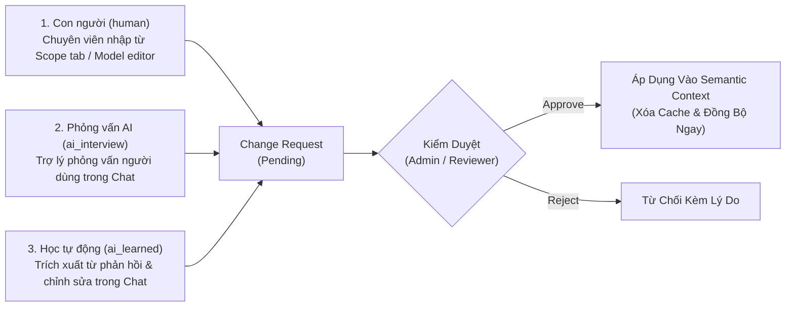

# Quy Trình Đề Xuất Thay Đổi Ngữ Nghĩa (Change Requests)

> **Điều hướng:** Studio → DABI → Change Requests (hoặc truy cập trực tiếp `/admin/change-requests`)

Trong môi trường doanh nghiệp, lớp ngữ nghĩa (Semantic Layer) là nguồn chân lý duy nhất định hình cách AI hiểu và tính toán dữ liệu. Bất kỳ sự thay đổi sai lệch nào về từ đồng nghĩa, công thức hoặc phạm vi phân quyền đều có thể dẫn đến việc AI trả lời sai hàng loạt báo cáo cho ban giám đốc.

Tính năng **Change Requests (Đề Xuất Thay Đổi)** cung cấp cơ chế kiểm soát chất lượng nghiêm ngặt: cho phép mọi thành viên đóng góp tri thức nghiệp vụ nhưng chỉ những người có thẩm quyền mới được phép phê duyệt áp dụng vào hệ thống.

---

## 1. Nguyên Tắc Cốt Lõi: "Ai Cũng Có Thể Đề Xuất, Chỉ Người Duyệt Mới Được Áp Dụng"

*(Anybody may propose, only a reviewer may approve)*

Trong thực tế doanh nghiệp:
- **Người nắm rõ từ vựng nghiệp vụ nhất:** Thường là nhân viên kinh doanh, kế toán viên hoặc trưởng bộ phận vận hành — những người trực tiếp chat với AI hàng ngày.
- **Người quản trị kỹ thuật (Admin / Data Lead):** Là người nắm quyền sửa đổi cấu hình Data Model và Semantic Context nhưng không thể biết hết mọi thuật ngữ lóng, từ viết tắt của từng phòng ban.

Vì vậy, Semantix phân tách rạch ròi 2 tầng quyền hạn:
1. **Quyền Đề Xuất (Propose):** Chỉ cần quyền xem (**`VIEW`**) trên Context. Bất kỳ người dùng nào khi phát hiện AI hiểu sai thuật ngữ phòng ban mình đều có thể cung cấp thông tin qua phỏng vấn AI hoặc giao diện đề xuất.
2. **Quyền Phê Duyệt (Approve):** Bắt buộc phải có quyền quản trị/chỉnh sửa (**`canApproveContextChange`** hoặc **`edit_context`**). Mọi đề xuất luôn được khởi tạo ở trạng thái chờ duyệt (`status: "pending"`), không bao giờ tự động áp dụng.

---

## 2. Ba Nguồn Gốc Đề Xuất (Change Request Origins)

Hệ thống phân loại rõ nguồn gốc của từng đề xuất thông qua thuộc tính `origin`:



| Nguồn gốc (`origin`) | Mô tả | Cách hình thành |
|---|---|---|
| **Con người (`human`)** | Chuyên viên dữ liệu chủ động đề xuất | Tạo từ giao diện chỉnh sửa Context hoặc tab Scope khi người dùng không có quyền ghi trực tiếp. |
| **Phỏng vấn AI (`ai_interview`)** | Trợ lý AI chủ động phỏng vấn người dùng | Khi người dùng phàn nàn *"trợ lý hiểu sai từ dư nợ"*, kỹ năng `context-interview` kích hoạt công cụ `clarify_context_needs` để hỏi rõ các thuật ngữ, sau đó gọi `submit_context_proposal` để đóng gói thành đề xuất. |
| **Học tự động (`ai_learned`)** | Hệ thống tự động đúc kết từ hội thoại | Khi người dùng nhiều lần chỉnh sửa *"ý tôi là doanh số, không phải tiền thu"*, hệ thống gom cụm phản hồi (Feedback Clusters) và tự động tạo đề xuất học ngữ nghĩa mới. |

---

## 3. Cơ Chế Payload 2 Nửa An Toàn (The Two-Halves Payload Pattern)

Một thách thức kỹ thuật lớn trong việc xét duyệt cấu hình JSON phức tạp là: **Làm sao để người duyệt nhìn thấy rõ sự khác biệt (Diff), đồng thời hệ thống thực thi cập nhật chính xác mà không ghi đè mất các trường dữ liệu khác?**

Semantix giải quyết vấn đề này bằng thiết kế **Payload 2 Nửa An Toàn**:

```
┌────────────────────────────────────────────────────────────────────────┐
│                        CHANGE REQUEST PAYLOAD                          │
├──────────────────────────────────┬─────────────────────────────────────┤
│   NỬA 1: SNAPSHOT TRỰC QUAN      │      NỬA 2: MAP THỰC THI            │
│   (Phục vụ giao diện xem Diff)   │      (Phục vụ cập nhật dữ liệu)     │
├──────────────────────────────────┼─────────────────────────────────────┤
│ • columnContexts: [ ... ]        │ • columnSynonyms: { col_1: [...] }  │
│ • metricContexts: [ ... ]        │ • columnAntiSynonyms: { ... }       │
│ • aiInstructions: "..."          │ • columnGotchas: { ... }            │
│ • defaultSettings: { ... }       │ • metricSynonyms: { met_1: [...] }  │
│                                  │ • metricAntiSynonyms: { ... }       │
└──────────────────────────────────┴─────────────────────────────────────┘
```

### 3.1. Nửa 1: Snapshot Trực Quan (`columnContexts`, `metricContexts`)
- Chứa toàn bộ mảng dữ liệu đã được gộp (merge) giữa trạng thái hiện tại và nội dung đề xuất.
- Bộ máy so khớp `computeDiff` sử dụng nửa này để dựng giao diện trực quan:
  - Dòng nào được thêm mới (màu xanh lá).
  - Từ đồng nghĩa / Anti-synonym nào được bổ sung.
  - Hướng dẫn nào được chỉnh sửa (màu vàng).
- Giúp người duyệt nắm bắt thay đổi chỉ trong vài giây mà không cần đọc mã nguồn.

### 3.2. Nửa 2: Map Thực Thi (`columnSynonyms`, `columnGotchas`, `metricAiHints`...)
- Là các đối tượng ánh xạ tường minh dạng `Record<ID, Giá_Trị>`.
- Khi người duyệt nhấn **Approve**, hành động `applyContextUpdates` chỉ nhận và cập nhật đúng các trường được chỉ định trong map.
- **Tính cộng dồn tri thức (Additive Knowledge):** Các từ đồng nghĩa do quản trị viên nhập từ trước sẽ không bao giờ bị ghi đè hay xóa mất bởi một đề xuất chỉ thêm 1 từ mới.

> [!IMPORTANT]
> **Quy tắc toàn vẹn dữ liệu:** Nếu một đề xuất chỉ có Nửa 1, hệ thống duyệt thành công nhưng không có gì thay đổi trong database. Nếu chỉ có Nửa 2, người duyệt không thể kiểm tra Diff. Semantix luôn bắt buộc cả 2 nửa phải hiện diện đồng thời.

---

## 4. Tách Biệt Đề Xuất Chỉ Số Mới (`Metric Candidates`)

Trong quá trình phỏng vấn người dùng, họ thường nhắc đến những chỉ số mà **Data Model hiện tại chưa hề có** (Ví dụ: *"Tôi muốn xem Tỷ lệ nợ xấu trên tổng tài sản"*).

- **Xử lý an toàn:** Semantic Context chỉ quản lý ngữ nghĩa của các trường đã tồn tại, không thể tự tạo ra Metric mới trong Model.
- Do đó, hành động `proposeContextChange` sẽ tự động bóc tách các chỉ số mới (`metricCandidates`) và chuyển sang hàng đợi **Đề Xuất Chỉ Số (Metric Suggestions)** tại `/admin/ai-hub/suggestions`.
- Điều này ngăn chặn việc đề xuất bị lỗi hoặc âm thầm làm rơi rụng ý tưởng của người dùng.

---

## 5. Hướng Dẫn Quy Trình Phê Duyệt Cho Reviewer

1. Truy cập **Studio → DABI → Change Requests**.
2. Bộ lọc danh sách:
   - Trạng thái: `Pending` (Chờ duyệt), `Approved` (Đã duyệt), `Rejected` (Đã từ chối).
   - Nguồn gốc: Lọc theo `Human`, `AI Interview` hoặc `AI Learned`.
3. Nhấn vào một Change Request để xem chi tiết:
   - **Thẻ tóm tắt:** Người gửi đề xuất, thời gian, ngữ cảnh liên quan.
   - **Giao diện So sánh (Visual Diff):** Xem sự thay đổi của từng Cột, Chỉ số, Anti-synonyms, Gotchas và AI Instructions.
   - **Tài nguyên bị ảnh hưởng (Impacted Resources):** Danh sách các AI Assistant và Dashboard đang phụ thuộc vào Context này.
4. Quyết định:
   - **Chấp thuận (Approve):** Nhấn Approve. Hệ thống tự động thực thi cập nhật dữ liệu, xóa cache mô hình (`model-cache`), và revalidate toàn bộ Assistant ngay lập tức.
   - **Từ chối (Reject):** Nhập lý do từ chối để lưu vào lịch sử kiểm toán (Audit Trail) và phản hồi lại người đề xuất.

---

## 6. Tổng Kết

Quy trình Đề Xuất Thay Đổi Ngữ Nghĩa là cầu nối hoàn hảo giữa **tri thức thực tế của người dùng nghiệp vụ** và **sự chuẩn mực của hệ thống quản trị dữ liệu**. Nhờ đó, Semantix liên tục thông minh hơn sau mỗi ngày sử dụng mà vẫn đảm bảo tính an toàn, bảo mật và chính xác tuyệt đối.
